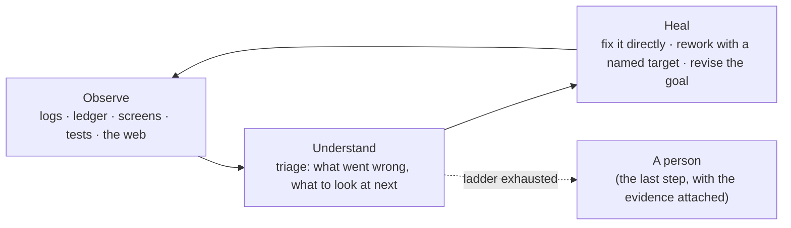

# Graph engineering and self-healing loops

**In one sentence:** every job elanous runs — shipping a code change, running a pipeline, watching a market — is one loop: **observe → understand → heal**, drawn as a graph that elanous can reshape while it runs.

This page explains the model. It separates what ships today from what is in progress; where a number would go stale, it gives you the command that measures it.

## One loop, many domains



The loop is the same whatever the domain. What changes from one domain to another is only:

- **The senses and hands you attach.** A coding run observes tests and diffs and acts through a worktree; a trading run observes prices and news and acts through orders. Both plug into the same loop as *observe* nodes and *execute* nodes.
- **The posture.** How deep observation goes, how long the healing loop may run, how widely it grounds itself in outside sources, and which actions are allowed — all rise and fall with the situation, the way a readiness level does.

## Resolution rises with difficulty

When something fails, elanous does not jump straight to a person. It raises its own resolution:

| Level | What it looks at | Example |
|---|---|---|
| L0 — signature | the failure itself: gate facts, which files are unverified, what repeated since the last round | "no failing test, but the same two files are unverified again" |
| L1 — closer observation | logs, the run ledger, the child's screen, the failing test re-run verbosely | "the test imports a module that the change deleted" |
| L2 — outside grounding | the web, developer documentation, issues and pull requests, cited | "this library changed its API in the last release" |
| Last — a person | only when the ladder is exhausted, with every triage result attached | |

Each step is a node in the graph; triage decides which level comes next from what it has seen, not from a fixed rule a person set.

## Posture: how hard the loop works depends on the situation

Resolution is local — one run climbing its own ladder. **Posture** is global — how alert the whole system should be right now. elanous borrows the military idea of a readiness level: **5 is peacetime, 1 is war.**

A posture level carries a response profile. The market-watch loop that ships today already defines one:

| Posture | Observation cadence | Observation depth | Alerts |
|---|---|---|---|
| 5 | ×1 | rules only | batched |
| 4 | ×2 | second-stage check | priority |
| 3 | ×5 | cross-check | immediate |
| 2 | ×15 | deep | immediate |
| 1 | ×30 | emergency | immediate |

Posture never places an order or blocks an action on its own: at high alert, irreversible actions are **escalated to a person**, not refused.

The direction elanous is taking is to let posture set the frame for every loop, not only market watching: the floor and ceiling of the resolution ladder, the loop budget, and **how widely the loop grounds itself outside** — free search at peacetime, deep search, developer documentation and community sources at high alert.

## Standard templates, reshaped while running

elanous keeps a small family of **standard templates** — reviewed graphs that are not edited by the machine:

| Template | For |
|---|---|
| Elanous development harness | elanous changing itself: isolated worktree, gate, unattended review, merge |
| General development | changes in any repository: plan, build, verify, review, land |
| Composite | work with execution or research in the middle: build, land, hand off, run, observe |
| Heal (shared) | called by all of the above when a step fails |

A run's graph is shaped twice:

1. **At launch** — from the template, the goal, the run contract (for example, where it runs) and past runs, elanous decides the graph for *this* run.
2. **While running** — when triage meets something new, the run supervisor adds a response node (a closer look, outside grounding, a probe) at that point.

The supervisor **chooses from a catalog and fills in arguments; code checks every insertion** (the node exists in the catalog, its inputs are satisfied, the graph still reaches an end, the visit budget holds). It never writes a graph freely. Each run records its template plus the ordered list of changes, so a resumed run — or the same run on another machine — rebuilds the same graph.

## A catalog built from parts elanous already has

The node catalog lists roles — *review*, *verify*, *triage*, *observe logs*, *ground externally*, *approval*, *release*, … — and maps each to the component that already does it. It marks where the same role has several implementations, so they can be consolidated rather than multiplied.

Node kinds describe what a node is allowed to do: **agent** (does work in a worktree), **gate** (runs checks), **git** (lands changes), **judge** (decides), plus **observe** (read-only), **hitl** (waits for a person without blocking) and **subgraph** (a whole graph as one node).

## Local or remote, the same graph

A run can execute on your machine or on a remote pod. The **run contract** decides where, once, at the start. The graph does not change with the place — only where each node executes, and rules derived from the contract (for example, a remote run must end with a pull request so the result does not vanish with the pod). Run state and the ledger are read from one place on the host.

## Workflows, tasks and intake

- A **graph** is the flow: order, branches, retries, pauses for approval, reshaping, healing.
- A **workflow** (`elanous wf`) is the body of a single node: a short DAG of prompts, HTTP calls, classification and templates.
- **Intake** turns what you say into tasks; the **task manager** runs a task by starting a graph.

## What ships today, what is in progress

| | Status (✅ in the latest release · 🟡 on main, in the next release · 🔄 in progress · 📋 designed) |
|---|---|
| Harness runs (implement · research · document · operate templates) | ✅ ships — the orchestrator drives them; the graph declaration is checked against every step |
| Graph runner with approval pauses and resume (`elanous graph run` · `graph approve` · `graph run --resume`) | ✅ ships |
| Run contract: local or remote (pod) | ✅ declared and resolved at run start |
| Node catalog | ✅ declared and checked (judge, execute and observe roles built from existing parts) · 🟡 heal roles execute through their recipes — other roles do not yet execute by role name |
| New node kinds (observe · hitl · subgraph) | ✅ accepted by the graph parser |
| Node outputs flowing to the next node · multi-way branching | 🟡 on main — next release (each node reads the run context; a node's last-line JSON `outcome` picks the edge) |
| Heal template with the resolution ladder | 🟡 on main — next release: the runner walks it; the first observation step marks deleted files by itself and a real failure class closes without a human (example below) · 🔄 the deeper observation and outside-grounding steps are still being filled in |
| Posture level and alert priority for market watching | ✅ in the code — the level is computed from regime inputs and tripwires, alert priority reads it, and each computation and change is logged |
| Posture setting cadence, resolution floor/ceiling, loop budget and grounding breadth | 📋 designed — most of the response profile is not consumed yet |
| Budget decision before a launch (`elanous harness budget --json` → proceed · next provider · wait for reset · stop, with reasons) | 🟡 on main — next release |
| Grounding sources registry (`elanous grounding sources list · add · discover · status`) | 🟡 on main — next release |
| Supervisor adding nodes at launch and while running | 📋 designed |
| Workflows as graph nodes (`wf:`) · graphs as workflow nodes · tasks that start graphs | 📋 designed |

### A real walk of the heal template

A code change failed its gate with **zero failing tests** — the only complaint was that a file it deleted could not be verified. The same input, walked by the runner (`elanous graph run graphs/heal/heal-loop.yaml --input …`):

- **Before the observation step could see deletions:** `collect → triage (needs deeper observation) → observe-deeper (empty) → triage (needs grounding) → ground-external (empty) → triage (exhausted) → failed`. The ladder climbed as designed, but each rung came back empty, so the loop ended with a person.
- **After:** `collect` checks the working tree, marks the file as deleted, and `triage` classifies the failure as untestable: `collect → triage (untestable) → acknowledge → done`. No person involved, and the loop never had to climb.

That difference — the same judgment reaching a different answer because an earlier node brought back a fact — is what the observation steps are for.

To see what actually ran:

```bash
elanous logs --event pipeline-node-entry --limit 40 --all --include-test --json --json-data
elanous graph status <graph_id>
```

## What this page deliberately does not claim

- That the in-progress rows work today. They do not yet.
- How often triage picks the right level. It is logged; its accuracy is not yet measured.
- Any fixed count of nodes, roles or templates. The catalog and templates are the source; count them when you need to.
