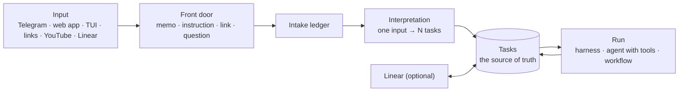

# Tasks and intake

**In one sentence:** whatever you throw at elanous — a sentence in Telegram, a note in the web app, a link, a YouTube video, an issue in Linear — lands in one place, becomes one or more **tasks**, and each task is run by the part of elanous that fits it (the harness for code changes, an agent with tools for jobs that only need running).

This page separates what ships today from what is in progress. Status marks: ✅ in the latest release · ✅ in v0.2.5 · 🔄 in progress · 📋 designed.

## The shape



- **Tasks are the source of truth.** An outside tracker such as Linear keeps a copy; elanous keeps the original.
- **Outside trackers are optional.** Without any, elanous still takes work in, triages it, runs it and reports back. Connecting Linear adds a second place to see and file the same tasks.

## Getting work in

| Where | What happens | Status |
|---|---|---|
| Telegram `/work <text>` | The front door classifies the text: a link to absorb, a list of tasks, or something to implement. Tasks wait for your approval; implementation goes to the harness. The reply comes back in the same chat. | ✅ 0.2.3 |
| Telegram, a plain link | The matching skill summarizes it (YouTube, X, GitHub, web) and saves a note. | ✅ · 🔄 recording it in the intake ledger |
| Telegram, a plain sentence | A normal chat answer. | ✅ · 🔄 recording it in the intake ledger |
| Web app intake page | A live preview of how the front door reads your text, then absorb or send to the harness. | ✅ 0.2.3 |
| Web app chat | A normal chat turn. | ✅ · 🔄 front door for chat |
| TUI | Links are summarized by the matching skill; a request that starts with the harness phrase ("implement with the harness …") offers the harness to the model. | ✅ |
| Daily collection | Trending videos, saved Telegram messages and GitHub activity are collected every morning, absorbed, checked against elanous, and summarized in a daily digest. | ✅ |
| Linear | Issues become tasks, by sync or by webhook (below). | ✅ 0.2.3 |

The intake ledger is the list of everything that came in:

```bash
elanous intake items --status new      # what has not been processed yet
elanous intake digest                  # today's summary: what was absorbed, one-line conclusions, goal candidates
```

⬜ Known limits today: the automatic queue only picks items that carry a link, so text-only notes wait; and the improvement candidates found by absorbing a video are shown in the digest but are not yet turned into tasks automatically.

## From an item to tasks

**Interpretation** reads an intake item and writes the task: a short title, why it matters, an acceptance criterion, a priority, and whether it is a code change or a job to run.

| | Status |
|---|---|
| Goal lines and idea notes → tasks, each typed **implement**, **research**, **document** or **operate**: `elanous intake to-tasks` (`--dry-run` to preview; needs the daemon running; at most 5 per run unless you pass `--limit`) | ✅ 0.2.4 |
| One item → several tasks, each typed as **run**, **implement**, **research** or **composite** | 📋 designed |
| Duplicate detection against existing tasks and past runs | 📋 designed |

An item without an acceptance criterion is sent back as a question instead of becoming a task.

## Approval and priority

- Tasks that come from outside (Linear, Telegram `/work`, intake) start as **backlog** and wait for approval.
- See what is waiting with `elanous tasks list --status backlog` and approve with `elanous tasks approve <id>`.
- Approved tasks run in **priority order** — urgent, high, medium, low — then oldest first, a few at a time.
- Auto-run rules can approve tasks from a given source, team, project or assignee automatically (configuration key `tox.external.autoRun`).

| | Status |
|---|---|
| Priority-ordered task loop | ✅ |
| Outside tasks waiting for approval · auto-run rules | ✅ 0.2.3 |
| Running approved outside tasks: `[dev]` → the harness, everything else → an agent with tools; intake tasks one at a time | ✅ 0.2.3 |
| `elanous tasks list · show · approve` — tasks in priority order, details, approval (needs the daemon running) | ✅ 0.2.3 |

## Linear

elanous works with Linear's **Basic** plan: issues and the API are all it needs.

**1. Store your API key** (read from stdin, never printed):

```bash
elanous connector linear set-key < linear-api-key.txt
```

**2. Pull issues in:**

```bash
elanous connector linear sync --team ENG --prefix "[elanous]" --dry-run
elanous connector linear sync --team ENG --prefix "[elanous]"
```

- `--team` is the team key; `--prefix` limits the sync to issues whose title starts with that text (or carry that label).
- Each issue becomes one task, identified by its Linear id — syncing twice does not create duplicates, and an issue that changed is updated.
- Linear priority maps to task priority: Urgent → high (the note "original priority: Urgent" is kept), High → high, Medium → medium, Low → low, none → medium. Within one sync, Urgent issues are created first, so they run ahead of High ones.
- Done, canceled and duplicate issues are skipped. One failing issue does not stop the rest; it is retried on the next sync.
- Put `[dev]` in an issue title to send it to the harness once approved; otherwise it runs as a job.

**Send an instruction to Linear as an issue:** `elanous directive add "<instruction>" --dry-run` shows how it will be filed; drop `--dry-run` to create the issue. In the terminal UI, `/directive <text>` does the same.

**3. Or receive webhooks** instead of syncing: store the signing secret with `elanous connector linear set-webhook-secret` (stdin) and run the receiver with `elanous hooks serve`. Signatures are checked and replayed deliveries are refused. The receiver needs a public HTTPS address in front of it.

| | Status |
|---|---|
| Issues → tasks (sync and webhook) | ✅ 0.2.3 |
| Task results written back to Linear (state, comments) | 📋 designed |
| Asana | Use the Asana connector of your coding agent (Claude Code); an elanous adapter is optional and designed |
| Jira | 📋 designed — not available |

## Without any outside tracker

Everything above works with no tracker connected. What a tracker gives you and where elanous has it:

| A tracker gives you | In elanous | Status |
|---|---|---|
| Issues, states, priority, sub-issues, projects | Tasks (with dependencies, parent task, mission, acceptance criteria) | ✅ |
| A board | TUI board, the web app task panel, task cards (`elanous card list` / `card show <id>`; a card board among the web app's Labs pages — turn on "Show Labs tabs" in Settings), and the web app's **Approvals** page | ✅ 0.2.4 |
| Filing by message or email | Telegram `/work`, the web app intake page | ✅ 0.2.3 · 📋 email |
| Triage suggestions and rules | Interpretation and auto-run rules | 🔄 · 📋 condition → action rules |
| Cycle time and lead time | Task timestamps and the run ledger | 📋 `tasks stats` |
| Scheduled and event-driven agents | The harness, the task loop and `elanous schedule` | ✅ |

## What this page deliberately does not claim

- That the 🔄 and 📋 rows work today. They do not yet.
- How often interpretation picks the right type or priority. It is not measured yet.

See also: [The harness](harness.md) · [Graph engineering](graph-engineering.md) · [Telegram](telegram.md).
