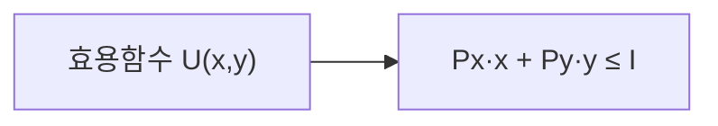

# Diagram Master

Mermaid는 elanous 자체 `MermaidRender` 도구로 터미널 그림을 그린다. Python·venv·Playwright·외부 API 없이 동작하는 기본 경로다. Python 기반 PNG 렌더러(Matplotlib, Excalidraw, Nano Banana 2, Mermaid PNG 및 SVG 캡처)는 **선택 애드온**이며 기본 경로의 전제 조건이 아니다.

**핵심 원칙**
- 콘텐츠를 분석하여 **최적 엔진 자동 선택** — 사용자가 엔진을 몰라도 됨
- 선택 엔진의 애드온이 없으면 `이 엔진은 애드온 설치가 필요합니다 (cd skills/diagram-master/references && uv sync --extra python-engines && uv run --extra python-engines playwright install chromium)`라고 안내한다. 구조/흐름처럼 Mermaid로 대체 가능한 요청이면 먼저 Mermaid로 실제 그림을 렌더하고, 정밀 곡선·3D·AI 이미지 등 대체 불가능한 요청에는 없는 결과물을 만들어냈다고 말하지 않는다. 명시적으로 다른 엔진을 요청했다면 대체했음을 밝힌다.
- 각 엔진의 레퍼런스 문서는 `references/engines/<engine>/` 에 위치
- 생성 후 **품질 검증** 필수 — `references/quality-checklist.md` 참조

## When to Use

모든 다이어그램/시각화 요청 시 이 스킬이 **유일한 진입점**.
다른 스킬(course-master, lecture-note-digitizer 등)에서도 다이어그램 필요 시 이 스킬에 위임.

트리거: 다이어그램, 차트, 시각화, 그래프, 곡선, 플롯, 흐름도, 구조도, diagram, chart, plot, visualize, graph, 그려줘, SVG, excalidraw, mermaid, 인터랙티브, interactive

## 실행 모드

| 모드 | 트리거 | PDF 원본 다이어그램 처리 | 설명 |
|------|--------|------------------------|------|
| **auto** (기본) | 별도 지정 없음 | PDF 추출 우선 → 나머지 재생성 | 효율 우선 |
| **recreate** | "재생성", "다시 그려", "스킬로", "recreate" | **모두 재생성** (PDF 추출 스킵) | 품질 우선 |

## Auto-Routing Decision Tree

**반드시 이 순서로 판단** (상세: `references/routing-guide.md`):

```
Step 0: 모드 판단
  → recreate 모드: Step 0a 스킵, Step 1로 직행
  → auto 모드(기본): Step 0a로

Step 0a: PDF 원본에 이미 고품질 다이어그램이 있는가? [auto 모드 전용]
  → YES: PDF 추출 (재생성 불필요)
  → NO: Step 1로

Step 1: 사용자가 엔진을 명시했는가?
  "mermaid로", "matplotlib으로", "excalidraw로", "svg로", "나노바나나로", "AI로 그려"
  → YES: 해당 엔진 사용

Step 2: 인터랙티브 요청인가?
  키워드: interactive, 버튼, 토글, 호버, 클릭, 탐색
  → YES: SVG interactive

Step 3: 수학적 정밀도가 필요한가?
  함수 곡선, 분포, 히스토그램, 축/눈금 정밀, 3D, 회귀선, 경제학 모델
  → YES: Matplotlib

Step 4: 코드 기반 엔진으로 표현이 어려운 복잡한 시각물인가?
  해부학 도면, 지리적 지도, 복잡한 인포그래픽, 일러스트 스타일
  → YES: Nano Banana 2 (AI 이미지 생성)

Step 5: 자유형 레이아웃이 필요한가?
  비정형 배치, 손그림, 곡선 연결, 비선형 구조
  → YES: Excalidraw

Step 6: 기본 → Mermaid
  흐름도/구조도는 MermaidRender 그림; 시퀀스·상태·ER·타임라인·간트·마인드맵은 Mermaid 코드 블록 또는 PNG 애드온
```

---

## 엔진별 상세

### 1. Mermaid (기본, 최우선)

**레퍼런스**: `references/engines/mermaid/syntax-reference.md`, `references/engines/mermaid/domain-templates.md`

- **용도**: 흐름도, 구조도, 시퀀스, 상태, ER, 타임라인, 간트, 마인드맵, 클래스, 파이
- **기본 렌더**: `MermaidRender` 네이티브 도구. Python 없이 `flowchart LR/RL/TB/BT`의 라벨 노드·화살표를 Unicode/ASCII로 렌더한다. `MermaidSyntax`는 문법 참고용이며 출력 포맷을 넓히지 않는다.
- **수식/그 밖의 Mermaid 타입**: Mermaid 코드 블록으로 제공하되 `MermaidRender`가 지원하지 않는 타입을 렌더했다고 주장하지 않는다. PNG가 꼭 필요하면 별도 Python/Playwright 애드온의 `render_mermaid.py`를 선택한다 (`@svg-katex` 전용 렌더러는 이 팩에 없음).
- **강점**: 기본 경로는 텍스트 기반으로 Python/venv 없이 작동; ELK·PNG는 선택 애드온의 별도 렌더 경로

**Mermaid rich 코드 규칙 (선택 PNG 애드온용; 아래 classDef 색상은 터미널 MermaidRender에 반영되지 않음)**:
- classDef + :::className — 시맨틱 스타일 적용
- PNG 애드온에서는 Frontmatter `title`, `config.layout: elk`, `config.theme: base` 사용 가능. 기본 `MermaidRender`용 flowchart에는 붙이지 않는다 (이 도구가 지원하는 간단한 문법만 사용).
- NEVER guess syntax — 반드시 `syntax-reference.md` 참조
- `end` 예약어는 `"end"`로 감쌈
- `%%` 주석 사용 (// 금지)

**시맨틱 색상 팔레트**:

| Role | classDef | 용도 |
|---|---|---|
| primary | `fill:#3b82f6,stroke:#1e3a5f,color:#fff` | 핵심 개념 |
| secondary | `fill:#8b5cf6,stroke:#5b21b6,color:#fff` | 보조 개념 |
| accent | `fill:#f59e0b,stroke:#92400e,color:#fff` | 강조 포인트 |
| success | `fill:#bbf7d0,stroke:#166534` | 결과, 완료 |
| warning | `fill:#fef08a,stroke:#854d0e` | 제약, 주의 |
| danger | `fill:#fecaca,stroke:#991b1b` | 오류, 위험 |
| neutral | `fill:#e5e7eb,stroke:#374151` | 설명, 배경 |

**Compact vs Complex 모드**:
- Compact (기본, ≤6 노드): `flowchart LR`, 세로 길이 최소화
- Complex (>6 노드, 2단계+ 중첩): `flowchart TB` 허용

**수식 라벨**:

수식은 Mermaid 코드 블록으로 표현하거나, 이미지가 필수면 지원되는 애드온을 사용한다. `@svg-katex` 표기는 텍스트 레퍼런스용이며 이 팩에는 이를 PNG로 변환하는 전용 스크립트가 없다. 예:

````markdown

````

`.mmd` 파일에는 **반드시 단일 백슬래시** 사용 (`\frac` O, `\\frac` X).

**다이어그램 타입 선택**:

| User Intent | Type |
|---|---|
| 프로세스, 의사결정 | `flowchart` |
| API 호출 순서 | `sequenceDiagram` |
| OOP 구조 | `classDiagram` |
| 상태 머신 | `stateDiagram-v2` |
| DB 스키마 | `erDiagram` |
| 프로젝트 일정 | `gantt` |
| 비율 분포 | `pie` |
| 계층 브레인스토밍 | `mindmap` |
| 시간순 이벤트 | `timeline` |
| 에너지/흐름 분배 | `sankey` |
| 데이터 차트 | `xychart` |
| 시스템 레이아웃 | `block` |
| 다축 비교 | `radar-beta` |

**기본 렌더링 (Python 불필요)**: `MermaidRender({"source":"flowchart LR\n  A[시작] --> B[완료]"})`를 호출하고 반환된 그림을 사용자에게 보여준다. 파일로도 필요하면 `.mmd` 원본을 저장한다. 터미널의 Unicode/ASCII 그림이지 PNG/SVG 이미지가 아니다. 실제 지원 범위는 `MermaidRender` 설명대로 flowchart 방향 LR/RL/TB/BT의 노드·화살표이며, 시퀀스/ER/ELK 및 복잡한 스타일은 이 도구로 렌더되었다고 주장하지 않는다.

**선택 PNG 애드온**: 먼저 아래 설치 명령으로 애드온을 설치한 환경에서만 `references/`에서 `uv run --extra python-engines python engines/mermaid/render_mermaid.py {mmd_file} --scale 3`을 사용한다. 이 경로는 Playwright와 Mermaid.js CDN을 사용하며 오프라인 기본 경로가 아니다.

**Known Issues**:
- Playwright에서 `ElementHandle.screenshot(scale=N)` 에러 → `device_scale_factor` 사용
- Typora: classDef 대신 `style NodeId fill:...` 인라인 사용
- ELK: `wrappingWidth` 무시 → `<br/>`로 명시적 줄바꿈
- HTML/PDF에서 Mermaid.js CDN 타이밍 이슈 → PNG가 필요할 때에만 **애드온 설치 후** `render_mermaid.py`로 사전 렌더링하여 `` 삽입

---

### 2. Matplotlib (수학/과학 정밀)

**레퍼런스**: `references/engines/matplotlib/matplotlib-patterns.md`

- **용도**: 함수 곡선, 통계 분포, 히트맵, 3D, scatter, 경제학 모델
- **강점**: 정밀한 축/눈금, LaTeX 수식, 다양한 차트 타입, 3D
- **스크립트 규칙**: `plt.savefig()` / `plt.show()` 호출 금지, `np`/`plt` 자동 사용 가능, 한글 자동 지원

**렌더링**:
```bash
cd ./references
uv run --extra python-engines python engines/matplotlib/render_matplotlib.py {script.py} --dpi 300
uv run --extra python-engines python engines/matplotlib/render_matplotlib.py {script.py} --output /path/out.png
uv run --extra python-engines python engines/matplotlib/render_matplotlib.py {script.py} --figsize 12 8
uv run --extra python-engines python engines/matplotlib/render_matplotlib.py {script.py} --style dark_background
```

---

### 3. Excalidraw (자유형)

**레퍼런스**: `references/engines/excalidraw/element-templates.md`, `references/engines/excalidraw/json-schema.md`, `references/engines/excalidraw/color-palette.md`

- **용도**: 개념 스케치, 비정형 배치, 손그림 느낌, Evidence Artifacts
- **강점**: 위치 자유도 최고, 곡선 연결
- **핵심 철학**: "Diagrams should ARGUE, not DISPLAY" — Isomorphism Test 준수

**디자인 프로세스**:
1. Depth 평가 (Simple/Conceptual vs Comprehensive/Technical)
2. 기술 다이어그램 → 실제 스펙 리서치 필수
3. 개념 → 비주얼 패턴 매핑 (Fan-Out, Convergence, Tree, Timeline, Spiral, Assembly Line 등)
4. 각 주요 개념에 **다른 비주얼 패턴** 사용 — 균일 카드 그리드 금지
5. JSON 생성 (대형 다이어그램은 섹션별 빌드)
6. 선택 애드온이 없으면 설치 한 줄 안내 또는 Mermaid 대체; 있으면 렌더링 & 검증 루프

**Container vs Free-Floating Text**: 기본은 free-floating text. Container는 focal point, visual grouping, 화살표 연결 대상일 때만 사용. <30% 텍스트만 container 안에.

**스타일**: `roughness: 0` (기본), `opacity: 100` (항상), `fontFamily: 3`

**대형 다이어그램 전략**: 한 번에 전체 JSON 생성 금지 → 섹션별 빌드 (Section 1 → Edit으로 Section 2 추가 → ...). namespace seeds로 ID 충돌 방지 (100xxx, 200xxx...).

**렌더링**:
```bash
cd ./references
uv run --extra python-engines python engines/excalidraw/render_excalidraw.py {excalidraw_file}
```

---

### 4. SVG (웹 임베딩 / 인터랙티브)

**레퍼런스**: `references/engines/svg/svg-element-templates.md`, `references/engines/svg/interactivity-patterns.md`, `references/engines/svg/color-palette.md`, `references/engines/svg/html-base-template.html`

- **용도**: 웹 배포용 다이어그램, 호버/클릭 인터랙션, 애니메이션, 대규모 데이터 시각화
- **STATIC 모드** (기본): 인라인 SVG + 입장 애니메이션 + 호버 효과
- **INTERACTIVE 모드** (명시 요청 시): HTML 파일 + Tailwind + vanilla JS

**Auto-Routing (STATIC vs INTERACTIVE)**:
- STATIC: 단순 "다이어그램 만들어줘", 비교/흐름도/계층
- INTERACTIVE: "인터랙티브", "토글", "호버", "클릭", "탐색" 키워드

**STATIC 출력**: `.live-diagram` 컨테이너 내 인라인 SVG, dark background (#0f172a), hover glow, dashFlow animation
**INTERACTIVE 출력**: 단일 `diagram.html` (Tailwind CDN + SVG + vanilla JS)

**인터랙티브 기능**: 레이어 토글, 노드 호버 (brightness + tooltip), 클릭 상세, 비교 토글, Progressive Disclosure (Overview → Hover → Click deep dive)

**대규모 데이터**: SVG + Canvas fallback으로 D3.js 역할 흡수. 네트워크 그래프, 1000+ 데이터포인트도 SVG 엔진으로 처리.

**접근성**: `role="img"`, `aria-label`, `tabindex="0"`, keyboard navigation (Tab, Enter/Space, Escape)

**렌더링**:
```bash
cd ./references
uv run --extra python-engines python engines/svg/render_interactive_svg.py {html_file} --capture-states
```

---

### 5. Nano Banana 2 (AI 이미지 생성)

Google Gemini 3.1 Flash Image Preview 기반 AI 다이어그램 생성.

- **모델**: `gemini-3.1-flash-image-preview`
- **용도**: 해부학 도면, 지리적 지도, 복잡한 인포그래픽, 일러스트 스타일, 교과서급 도면
- **강점**: 4K 해상도, 정확한 텍스트 렌더링, 한국어 지원, 참고 이미지 기반 재생성
- **API 키**: `GEMINI_API_KEY` (환경변수에서 탐색)

**렌더링**:
```bash
cd ./references
# 텍스트 프롬프트
uv run --extra python-engines python engines/nanobannana/render_nanobannana2.py "수요 공급 곡선" --output diagram.png
# 참고 이미지 + 프롬프트
uv run --extra python-engines python engines/nanobannana/render_nanobannana2.py "깔끔하게 재생성" --ref original.png --output clean.png
# 프롬프트 파일
uv run --extra python-engines python engines/nanobannana/render_nanobannana2.py --file prompt.txt --output result.png
```

---

### 6. PDF 추출 (재사용)

원본 PDF에 이미 잘 그려진 다이어그램이 있을 때 **재생성하지 않고 추출**.

```bash
# 래스터 이미지 추출
pdfimages -png {input.pdf} {output_prefix}
# 벡터(SVG) 추출
mutool convert -o {output.svg} {input.pdf} {page_number}
# 고해상도 이미지
mutool draw -r 300 -o {output.png} {input.pdf} {page_number}
# crop
magick {input.png} -crop WxH+X+Y {output.png}
```

---

## Unified Render Pipeline

```
1. 콘텐츠 분석 → 엔진 자동 선택 (Decision Tree)
2. 참고 이미지가 있으면 → Read tool로 시각적 분석
3. 선택된 엔진의 reference docs 읽기 (필수)
4. Mermaid 가능 → 간단한 flowchart 코드를 Bash가 아닌 MermaidRender에 전달해 실제 터미널 그림을 얻는다. Python·설치 명령을 실행하지 않는다.
5. 다른 엔진 필수 → 애드온 설치 여부를 확인한다. 없으면 위 한 줄을 안내하고, Mermaid로 대체 가능하면 4로 돌아간다. 설치를 사용자 동의 없이 자동 수행하지 않는다.
6. 선택 엔진으로 렌더링 → Mermaid는 Unicode/ASCII, 애드온은 PNG/SVG 등 해당 형식으로 출력
7. 렌더 결과 확인 및 quality-checklist.md 기반 품질 검증, 필요시 수정/재렌더링
```

`MermaidRender`가 숨겨져 있거나 호출에 실패하면 그림을 만들었다고 주장하지 않는다. 사용 가능한 Mermaid 코드 블록을 제시하고 도구 의존성(`bun add mermaidtui`)을 안내한다. Python 애드온 설치로 기본 렌더 실패를 우회하지 않는다.

### 참고 이미지 (--ref) 통합 워크플로우

| 엔진 | --ref 처리 방식 |
|------|----------------|
| Nano Banana 2 | `--ref`로 직접 전달 → AI가 스타일 참조 |
| Matplotlib | Read tool로 분석 → 색상/레이아웃/축 스타일 코드 반영 |
| Excalidraw | Read tool로 분석 → 구조/배치/연결선 JSON 반영 |
| SVG | Read tool로 분석 → 레이어/색상/인터랙션 HTML 반영 |
| Mermaid | Read tool로 분석 → 기본 MermaidRender는 노드 구조만 반영; 색상 classDef는 PNG 애드온일 때 사용 |

## 목표 품질 기준

`references/examples/` 레퍼런스 이미지:

| 파일 | 스타일 | 최적 엔진 |
|------|--------|----------|
| `ref_grid_architecture.png` | 색상 코딩 그리드 + 아이콘 + 카드 | SVG interactive > NanoBanana2 |
| `ref_layered_flow.png` | 레이어 배경 + 다중 화살표 + Evidence | Excalidraw > SVG > NanoBanana2 |

**트리거 키워드**: "아키텍처 레퍼런스", "프로덕션 다이어그램", "스마트독 스타일", "Mem0 스타일"

## Quality Checklist (필수)

생성 후 `references/quality-checklist.md` 체크:

- **레이아웃**: 균등 타일 금지, 비대칭 선호, 정밀 간격
- **색상**: #000000 금지, 네온 금지, 시맨틱 색상
- **콘텐츠**: 필러 데이터 금지, 실제 Evidence 사용
- **기술**: 한글 깨짐 확인, 수식 렌더링 확인, 해상도 적절성
- **대형 다이어그램**: 섹션별 빌드, 30노드 초과 시 분할

## 다른 스킬에서 호출 시

### course-master 연동
```
Phase 3 다이어그램 처리 시:
1. 기존 PDF 다이어그램 → PDF 추출 검토
2. 새 다이어그램 필요 → diagram-master auto-routing
3. 수식 포함 구조도 → Mermaid 코드 블록 (전용 PNG 수식 렌더러 없음)
4. 경제학 곡선/분포 → Matplotlib 선택 애드온 (없으면 설치 한 줄 안내)
5. 기타 흐름/구조도 → MermaidRender 기본 그림
```

### lecture-note-digitizer 연동
```
Phase 3 Chart PNG 생성 시:
1. 다이어그램 유형 판단 → diagram-master auto-routing에 위임
2. 수학 곡선이 필요하면 → Matplotlib 선택 애드온; 없으면 설치 한 줄 안내 (정밀 곡선을 Mermaid 그림이라고 속이지 않음)
3. 그 외 PNG가 필수라면 Mermaid PNG 애드온을 설치; 터미널 그림으로 충분한 흐름도라면 MermaidRender 기본
```

## Content-Aware 전처리 (선택적)

| 축 | 분석 | 영향 |
|---|---|---|
| **Density** | 노드/요소 개수 → Low/Medium/High | High → 분할 또는 SVG 고려 |
| **Structure** | Flow/Hierarchy/Network/Spatial/Data | 구조 유형 → 엔진 매핑 |
| **Precision** | 텍스트 기반 / 수학적 / 자유형 | 정밀도 → Mermaid/Matplotlib/Excalidraw |

## 무료로 쓰는 길 (키 없이)

`MermaidRender`로 Python 없는 환경에서도 흐름도의 터미널 그림을 생성합니다. 정밀한 PNG·인터랙티브 캡처는 별도의 Python 애드온 설치 후 사용합니다. Nano Banana AI 이미지는 애드온과 API 키가 모두 필요합니다.

## 내 키로 쓰는 길

AI 이미지 생성이 필요하면 실행 환경의 `GEMINI_API_KEY`(또는 코드가 허용하는 `GOOGLE_API_KEY`)에 자신의 키를 설정하고 `references/engines/nanobannana/render_nanobannana2.py`를 실행합니다. 다른 엔진에는 이 키가 필요하지 않습니다. 키 값이나 자격 파일은 사본에 넣지 않습니다.

## 선택 애드온 설치

Mermaid 기본 렌더에는 설치가 필요하지 않습니다 (`MermaidRender`는 elanous의 `mermaidtui` 의존성을 사용). Python 엔진으로 PNG/캡처를 만들 때에만 저장소 루트에서 다음 한 줄을 실행합니다:

```bash
cd skills/diagram-master/references && uv sync --extra python-engines && uv run --extra python-engines playwright install chromium
```

애드온 설치 후 Python 스크립트는 `references/`에서 `uv run --extra python-engines python engines/<engine>/render_*.py`로 실행합니다. Nano Banana는 추가로 `GEMINI_API_KEY` 또는 `GOOGLE_API_KEY`가 필요합니다.
