# 분야별 Mermaid 템플릿 (복사해서 바로 사용)

모든 템플릿에 시맨틱 classDef 팔레트 + ELK layout 적용.
lecture-note-digitizer와 연동 시 이 템플릿을 기반으로 생성하세요.

## 공통 시맨틱 팔레트

```
classDef primary fill:#3b82f6,stroke:#1e3a5f,color:#fff
classDef secondary fill:#8b5cf6,stroke:#5b21b6,color:#fff
classDef accent fill:#f59e0b,stroke:#92400e,color:#fff
classDef success fill:#bbf7d0,stroke:#166534
classDef warning fill:#fef08a,stroke:#854d0e
classDef danger fill:#fecaca,stroke:#991b1b
classDef neutral fill:#e5e7eb,stroke:#374151
classDef groupA fill:#fed7aa,stroke:#c2410c
classDef groupB fill:#ddd6fe,stroke:#6d28d9
classDef groupC fill:#a7f3d0,stroke:#065f46
```

---

## 1. 경제학 / 경영학

### 1-1. 기본 흐름 구조

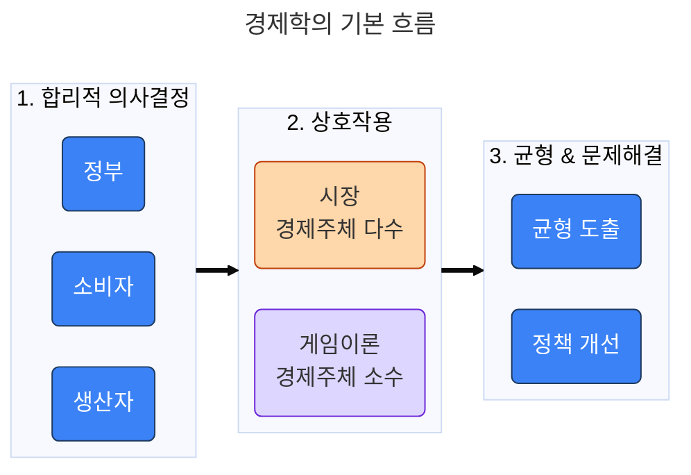

### 1-2. 한계분석 (MB = MC)

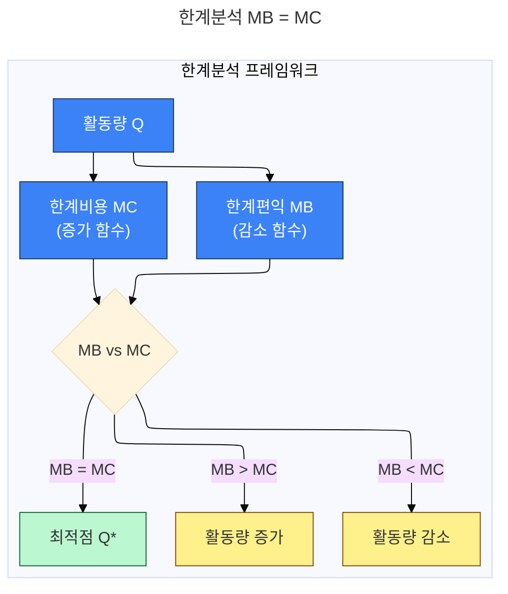

### 1-3. 소비자 최적화 문제

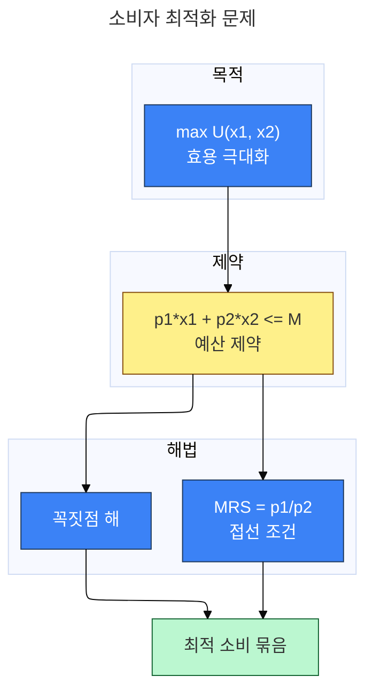

---

## 2. 컴퓨터과학 / 소프트웨어 공학

### 2-1. 시스템 아키텍처 (계층형)

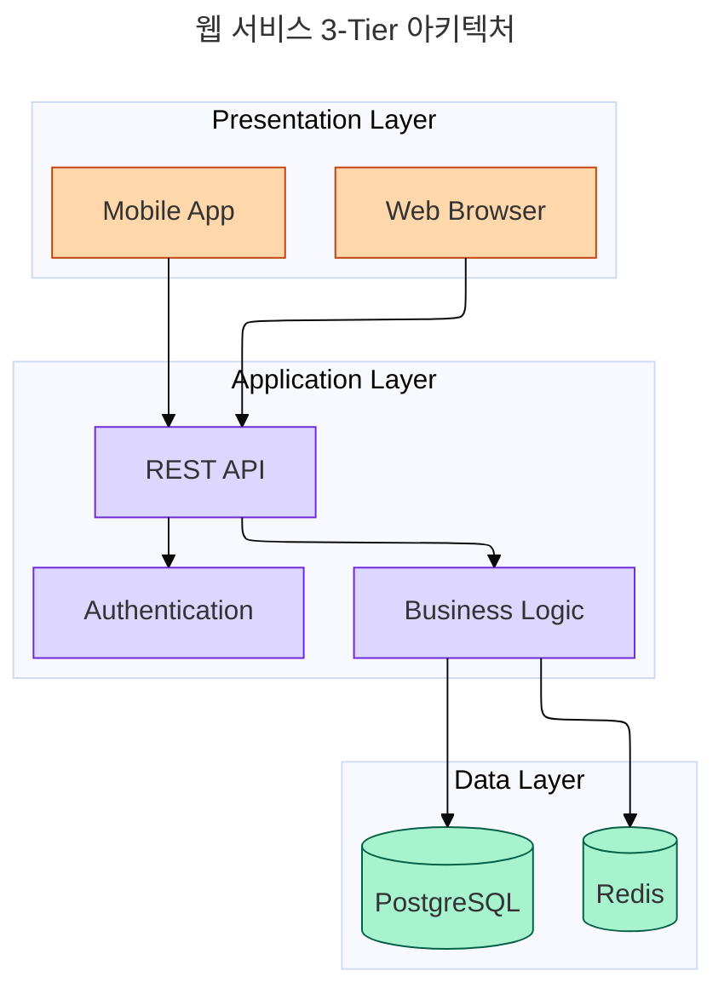

### 2-2. 알고리즘 흐름 (의사결정)

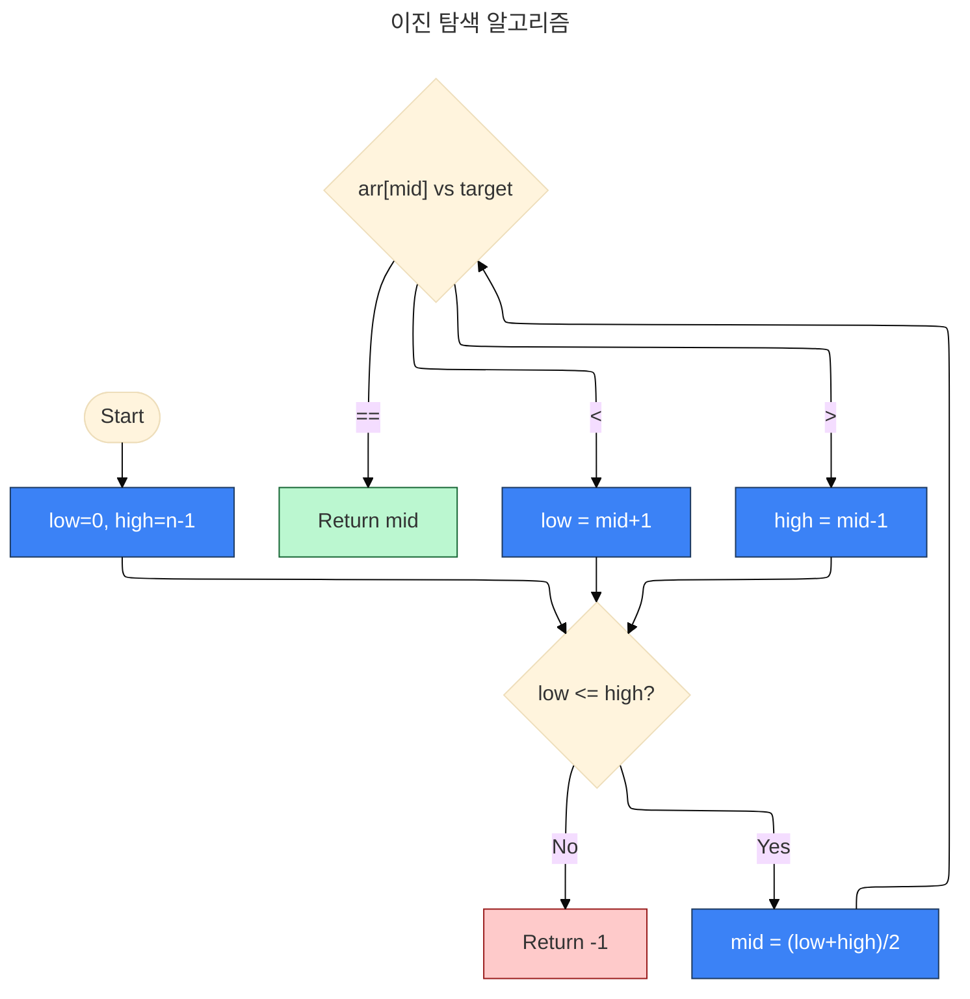

### 2-3. 디자인 패턴 (클래스 다이어그램)

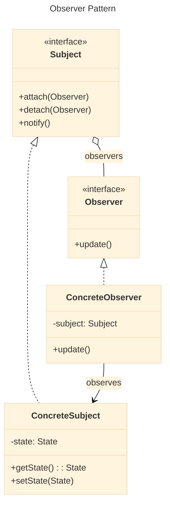

---

## 3. 자연과학

### 3-1. 실험 설계 흐름

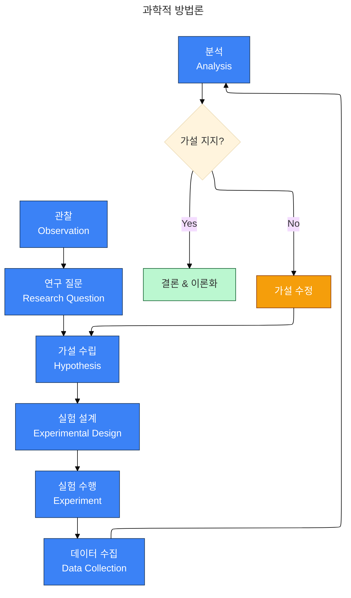

### 3-2. 생물학 — 세포 신호전달

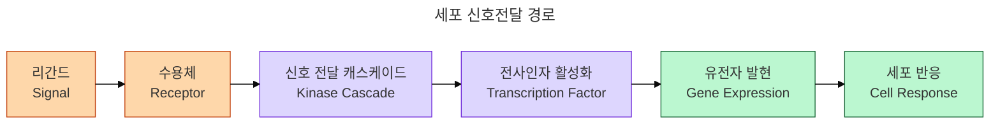

### 3-3. 화학 — 반응 에너지

```mermaid
xychart-beta
  title "반응 에너지 다이어그램"
  x-axis "반응 진행" [Reactant, "", "Transition State", "", Product]
  y-axis "에너지 (kJ/mol)" [0, 20, 40, 60, 80, 100]
  line [30, 50, 90, 60, 20]
```

---

## 4. 인문/사회과학

### 4-1. 연구 프레임워크

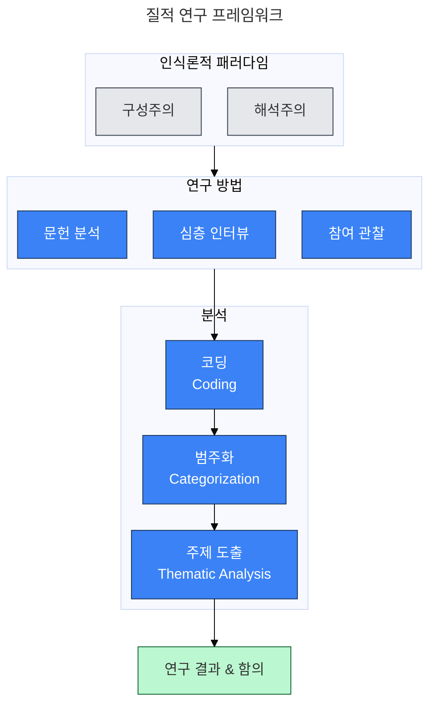

### 4-2. 역사 — 사건 타임라인

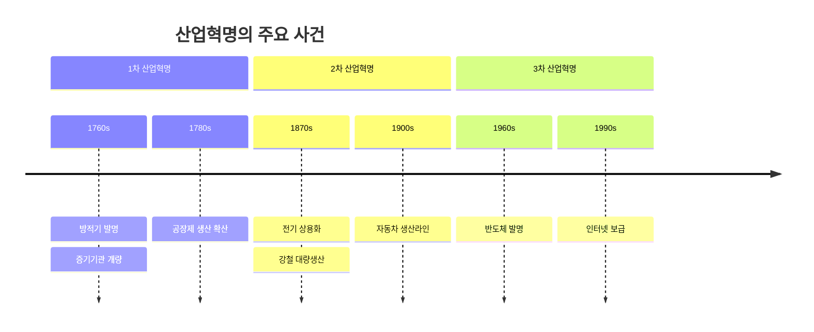

### 4-3. 법학 — 소송 절차

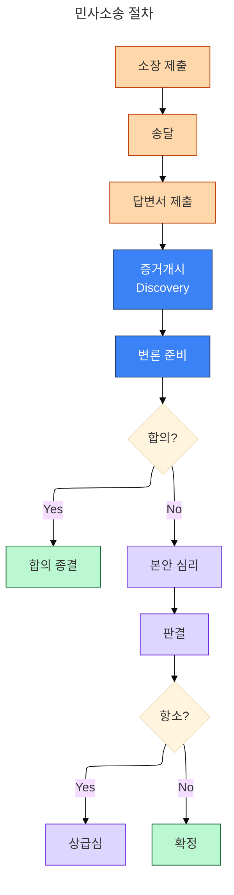

---

## 5. 의학 / 보건

### 5-1. 진단 알고리즘

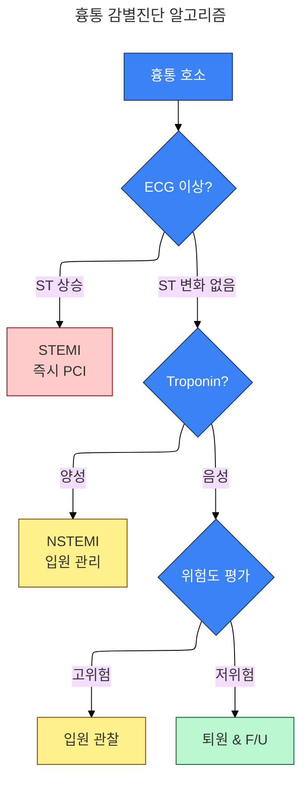

---

## 6. 공학 / 수학

### 6-1. 최적화 문제 구조

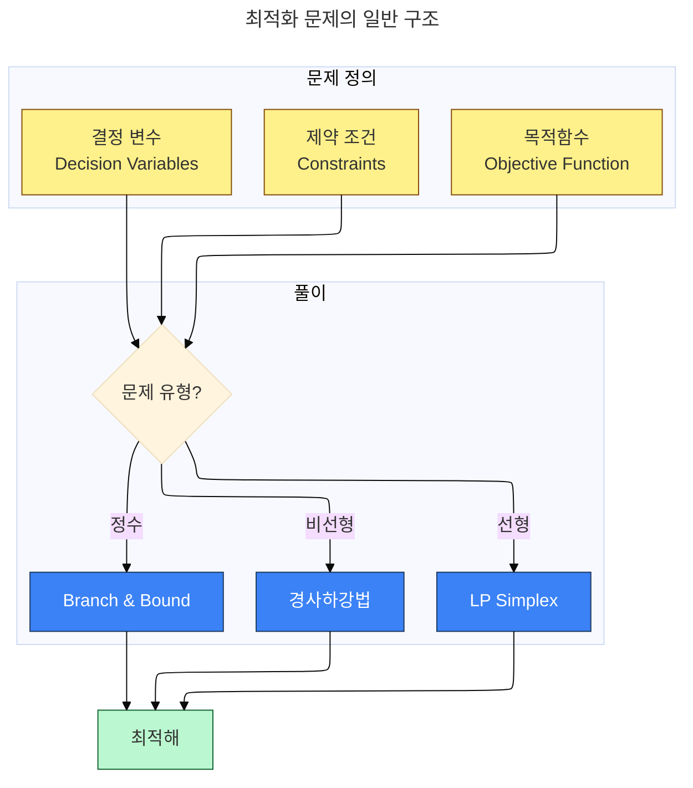

---

## 사용 가이드

1. 위 템플릿 중 분야에 맞는 것을 복사
2. 강의 맥락에 맞게 노드/라벨 수정
3. 시맨틱 팔레트(primary/success/warning 등)는 그대로 유지하되, groupA/B/C는 도메인에 맞게 이름 변경
4. `render_mermaid.py`로 PNG 생성 (PDF용)
5. Markdown에 Mermaid 코드 블록으로 삽입

**새로운 분야 추가**: 위 패턴을 따라 flowchart/sequence/mindmap 등으로 자유롭게 확장하세요.
