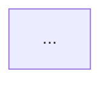

# Lecture Note Digitizer

손글씨 강의 노트 + 강의 요약을 종합하여 다이어그램 포함 디지털 강의 노트 PDF를 생성하는 스킬.

**핵심 원칙**
- **Mermaid 우선 (90%)**: 마크다운에 Mermaid 코드 내장 → render_mermaid.py로 PNG 생성
- **Excalidraw fallback (10%)**: 곡선 그래프, 완전 자유형만
- **Phase 2 후 사용자 확인 필수**: 마크다운 완료 후 반드시 피드백 받고 다음 단계 진행

## 전체 파이프라인

```
Input Sources (any combination):
  ├─ 손필기 노트 PDF / 이미지
  ├─ 강의 슬라이드 PDF
  └─ 강의 요약 / 녹취록 마크다운
        ↓
  Phase 1: 자료 수집 및 분석
        ↓
  Phase 2: 종합 Markdown (Mermaid 코드 포함)
        ↓
  ★ 사용자 확인 (구조/내용 피드백) ★
        ↓
  Phase 3: Chart PNG 생성 (Mermaid 우선, 곡선만 Excalidraw)
        ↓
  Phase 4: 통합 HTML 생성 (PNG 삽입)
        ↓
  Phase 5: Playwright PDF 변환
        ↓
  Output: {주차}_학습노트.pdf
```

---

## 무료로 쓰는 길 (키 없이)

로컬 PDF/이미지와 텍스트를 읽고 Markdown의 Mermaid 코드블록으로 노트를 작성합니다. 렌더링이 필요하면 형제 스킬 `../diagram-master/references`의 Mermaid 렌더러를 사용하고, PDF는 로컬 Playwright로 생성합니다. 입력이 이미지뿐일 때는 로컬 OCR을 먼저 사용합니다. 이 경로에 API 키는 필요하지 않습니다.

## 내 키로 쓰는 길

AI가 새 일러스트형 다이어그램을 만들어야 할 때만 형제 스킬의 Nano Banana 엔진에 자신의 `GEMINI_API_KEY` 또는 `GOOGLE_API_KEY`를 실행 환경변수로 전달합니다. 나머지 로컬 Mermaid/PDF 경로에는 키가 필요 없습니다. 키 값이나 자격 파일은 사본에 넣지 않습니다.

## Phase 1: 자료 수집 및 분석

### 1.1 입력 파일 탐색

사용자가 작업 디렉토리를 지정하면, 해당 디렉토리에서 관련 파일을 자동 탐색한다.

```
탐색 대상:
  ├─ *.pdf          → 강의 슬라이드, 손필기 노트
  ├─ *.md           → 강의 요약, 녹취록
  ├─ *.png/*.jpg    → 손필기 이미지 (사용자가 메시지에 첨부하는 경우)
  ├─ sources/common/  → 과목 공통 자료 (실라버스, 교재, 과목 개요 등)
  └─ 이전 주차 디지털 노트  → 포맷 참조용
```

### 1.2 자료 읽기

1. **손필기 PDF**: `Read` 도구로 페이지별 읽기 (한 번에 10페이지씩)
2. **강의 요약 마크다운**: `Read` 도구로 전체 읽기 (큰 파일은 분할)
3. **이미지**: `Read` 도구로 시각적 분석 (손글씨 다이어그램 해석)
4. **이전 주차 노트**: 포맷, 스타일, 구조 참조

### 1.3 구조 파악

읽은 자료를 바탕으로 강의의 논리적 구조를 파악한다:

- 강의의 **파트/섹션 구분** (주제별)
- 각 섹션의 **핵심 개념** 식별
- **다이어그램 후보** 식별 (손필기에서 그림/도표가 있는 부분)
- **Mermaid vs Excalidraw 분류** (아래 판단 기준 참조)
- **사례/케이스** 식별
- **핵심 공식/원칙** 식별

---

## Phase 2: 종합 디지털 강의 노트 (Markdown)

### 2.1 마크다운 구조

```markdown
# {과목명} {N}주차 강의 노트 ({날짜})
## {부제: 강의 핵심 주제}

---

## 목차
- [강의 개요](#overview)  ← **optional** (기본 미포함, 온보딩 시 결정)
- [용어집 (Glossary)](#glossary)
- [제1부: {섹션 제목}](#part1)
  - [1.1 {소주제}](#sec1-1)
  - [1.2 {소주제}](#sec1-2)
- [제2부: {섹션 제목}](#part2)
  - [2.1 {소주제}](#sec2-1)
- [부록: 다이어그램 목록](#appendix)

**부록 정책:**
- 마크다운: `# 부록: 다이어그램 목록` 섹션 항상 포함 (파일명, 유형, 내용 테이블). 다이어그램 변경 시 반드시 동기화.
- 웹 HTML / PDF: 부록 섹션 제외 — `regenerate_all_html.py`에서 마크다운 → HTML 변환 전 regex 스트리핑: `re.sub(r'\n---\n\n#+ 부록: 다이어그램 목록.*', '', md_text, flags=re.DOTALL)`

**강의 개요 정책:**
- 마크다운: 기본 미포함 (이미 생성된 노트에서는 제거 완료)
- 표지 정보(과목명, 교수, 일시 등)는 HTML 커버 페이지에서 직접 생성

---

<a id="overview"></a>
## 강의 개요 *(optional — 온보딩(Phase 0) 시 사용자가 포함 여부를 결정)*

> **기본 정책**: 주차별 노트에서는 기본 미포함. course-master 종합 가이드에 포함할 수 있음.

| 항목 | 내용 |
|------|------|
| 과목명 | ... |
| 일시 | ... |
| 주차 | ... |
| 핵심 키워드 | ... |

> **핵심 메시지**: {한 문장 요약}

---

<a id="glossary"></a>
## 용어집 (Glossary)

| 약어 | 영문 | 한국어 | 정의 |
|------|------|--------|------|
| \( MB \) | Marginal Benefit | 한계편익 | 활동 1단위 추가 시 얻는 추가 이득 |
| \( APL \) | Average Product of Labor | 노동의 평균생산 | 총생산량을 노동 투입량으로 나눈 값 |

> 해당 주차에서 **처음 등장하는** 약어/전문용어만 포함. 이전 주차에서 이미 정의된 용어는 생략.

---

<a id="part1"></a>
# 제{N}부: {섹션 제목}

<a id="sec1-1"></a>
## {N}.1 {소주제}

{내용}

```mermaid
flowchart TB
    ...Mermaid 코드...
```

### 사례/케이스 박스
{사례 내용}

---

<a id="appendix"></a>
# 부록: 다이어그램 목록
| # | 파일명 | 유형 | 내용 |
```

**목차 + 앵커 ID 규칙:**
- 마크다운 최상단에 `[텍스트](#앵커)` 형식 목차 포함
- 각 헤딩 바로 위에 `<a id="앵커"></a>` 삽입
- 앵커 ID는 영문 사용: `overview`, `glossary`, `part1`, `sec1-1`, `appendix` 등
- 이 구조는 마크다운(Typora/GitHub), 웹 HTML(사이드바), PDF(내부 링크) 3중 작동 보장

### 2.2 작성 원칙

1. **강의 순서 유지**: 실제 강의 진행 순서를 따른다
2. **손필기 + 요약 통합**: 손필기의 시각적 정보와 요약의 텍스트 정보를 결합
3. **Mermaid 코드 내장**: 각 다이어그램 위치에 Mermaid 코드블록 삽입 (GitHub/Obsidian에서 렌더링)
4. **표/테이블 활용**: 비교, 분류, 요약에 적극 활용
5. **수식/공식**: KaTeX LaTeX 구문 `\( ... \)` (인라인) 사용. 강조 수식은 `> \( ... \)` (blockquote + 인라인). **`$$ ... $$` 블록 수식은 사용 금지** — Typora에서 렌더링 깨짐. 분수는 `\frac{}{}`, 첨자는 `_x`, `^{n}`, 그리스문자는 `\varepsilon`, `\pi` 등. 절대로 `**볼드**`나 `` `code` ``로 수식을 표기하지 않는다. 상세 패턴은 `references/katex-style-guide.md` 참조.
6. **사례 박스**: 실제 기업 사례는 별도 박스로 구분
7. **핵심 원칙**: blockquote 또는 formula-box로 강조
8. **용어 정리 (Glossary)**: 각 주차 노트에 해당 주차에서 처음 등장하는 약어/전문용어를 정리하는 테이블을 강의 개요 바로 아래에 배치. 형식: `| 약어 | 영문 | 한국어 | 정의 |`. 예: `| \( APL \) | Average Product of Labor | 노동의 평균생산 | 총생산량을 노동 투입량으로 나눈 값 |`
9. **다이어그램 참조 방식 (하이브리드)**:
   - **Mermaid**: ` ```mermaid ``` ` 코드블록 유지 — Typora 렌더링 가능 + AI 학습 컨텍스트 보존. 소스 코드가 마크다운에 남아 있으므로 별도 .mmd 파일과 이중 관리 가능하나 장점이 크다.
   - **Excalidraw/슬라이드 추출**: `` 또는 `` — 코드로 표현 불가하므로 렌더링된 PNG를 직접 참조. Typora에서 바로 확인 가능.
   - **`<!-- DIAGRAM: ... -->` 코멘트는 더 이상 사용하지 않는다** — Excalidraw/슬라이드는 PNG 직접 참조로 교체.

### 2.3 사용자 확인 (필수)

Phase 2 완료 후, **반드시 사용자에게 마크다운을 보여주고 피드백을 받는다**.

```
확인 요청 항목:
  ├─ 강의 구조 (파트/섹션 분류)가 적절한지
  ├─ 다이어그램 후보 목록이 적절한지
  ├─ 내용의 정확성과 누락 여부
  └─ 추가/삭제/수정 요청
```

**사용자 확인 없이 Phase 3으로 진행하지 않는다.** 마크다운 단계에서 수정하는 것이 HTML/PDF 생성 후 수정하는 것보다 훨씬 효율적이다.

---

## Phase 3: 다이어그램 PNG 생성

### 3.1 다이어그램 소싱 판단 기준

| 다이어그램 유형 | 추천 Tool | 이유 |
|---|---|---|
| 단순 선형 흐름 (3~5 노드) | **Mermaid** flowchart | 텍스트 기반, 마크다운 내장 |
| 단순 비교/분류 | **Mermaid** flowchart + subgraph | 구조 가독성 |
| 계층 구조/분류 체계 | **Mermaid** flowchart/mindmap | 자동 레이아웃 |
| **복잡한 인과 루프/시스템 다이어그램** | **Excalidraw** | 자유 배치, 곡선 화살표, +/- 부호 |
| **매트릭스/2축 포지셔닝** | **Excalidraw** | 축 레이블, 영역 표시 |
| **비교/대조 개념도** | **Excalidraw** | 시각적 대비 효과 |
| 상태/생명주기 | **Mermaid** stateDiagram-v2 | 상태 전환 표현 |
| 시퀀스/상호작용 | **Mermaid** sequenceDiagram | 순서 표현 |
| 타임라인/역사 | **Mermaid** timeline | 내장 지원 |
| 데이터 차트 (이산값) | **Mermaid** xychart-beta | 막대/꺾은선 |
| **곡선 그래프 (원본 슬라이드에 있음)** | **PDF 추출** | 원본이 가장 정확하고 깔끔 |
| **곡선 그래프 (원본에 없음)** | **Excalidraw** | 새로 생성 필요 시 |
| **특수 레이아웃 (Porter 등)** | **PDF 추출** or **Excalidraw** | 원본 우선, 없으면 생성 |

### 3.2 PDF 슬라이드 원본 추출 (곡선/그래프)

원본 슬라이드 PDF에 수학적 곡선이나 정교한 그래프가 있는 경우, 직접 추출하는 것이 가장 깔끔하다.

```bash
cd ../diagram-master/references && \
  uv run python ../../lecture-note-digitizer/references/extract_slide_diagram.py \
  {슬라이드_PDF} --page {페이지번호} --output {출력_PNG}
```

**옵션:**
- `--page N`: 특정 페이지 추출
- `--pages 9,11,19`: 여러 페이지 일괄 추출
- `--crop "left,top,width,height"`: 백분율(%) 기반 크롭 (다이어그램 영역만 추출)
- `--dpi 300`: 해상도 (기본 300, 초고해상도 시 450)

**사용 시점:**
- 슬라이드에 곡선 그래프(무차별곡선, 수요-공급, 비용 곡선 등)가 이미 있을 때
- Excalidraw로 재현하면 곡선이 각지거나 가독성이 떨어질 때
- 교수가 만든 원본 그래프가 가장 정확할 때

### 3.3 다이어그램 생성 (diagram-master 위임)

1. **diagram-master 스킬 참조**: 다이어그램 생성 시 diagram-master 스킬의 auto-routing decision tree를 따른다 (구조도→Mermaid, 곡선/분포→Matplotlib, 자유형→Excalidraw 자동 선택)
2. **.mmd 파일 생성**: 각 다이어그램을 `{날짜}_mermaid_{번호}_{이름}.mmd`로 저장
3. **수식 포함 여부 판단**: 노드에 수식(분수, 첨자, 그리스문자 등)이 있으면 `@svg-katex` 힌트 추가
4. **PNG 렌더링**:
   - 일반 다이어그램: `render_mermaid.py`로 렌더링
   - `@svg-katex` 다이어그램: `render_mermaid_katex.py`로 렌더링 (KaTeX 수식 치환)
5. **병렬 생성**: 여러 .mmd를 순차적으로 렌더링 (Mermaid는 Excalidraw보다 빠름)

**@svg-katex 사용 시** (diagram-master → mermaid 엔진 참조):
마크다운의 ` ```mermaid ` 코드블록 안에 힌트를 작성한다 (마크다운이 source of truth).
````markdown

````
`.mmd` 추출 시 힌트가 자동 포함되며, 렌더링: `python render_mermaid_katex.py diagram.mmd --output diagram.png`

### 3.3 Excalidraw 다이어그램 생성 (fallback)

곡선/자유형 다이어그램만 Excalidraw로 생성:

1. **Agent 도구 활용**: 최대 6개씩 병렬로 다이어그램 생성
2. **diagram-master 스킬 참조**: 각 Agent에게 auto-routing 규칙 전달
3. **렌더링 검증**: 생성 후 PNG 렌더링하여 시각적 확인

### 3.4 색상 팔레트 (시맨틱 팔레트)

Mermaid `style` 인라인과 Excalidraw 공통으로 사용. **Mermaid에서 `classDef`/`class` 구문은 사용 금지** — Typora 호환성 문제. 대신 `style NodeId fill:...,stroke:...,color:...` 인라인 사용.

| Role | Mermaid style 인라인 | Excalidraw Fill/Stroke | 용도 |
|---|---|---|---|
| **primary** | `style X fill:#3b82f6,stroke:#1e3a5f,color:#fff` | `#dbeafe` / `#1e3a5f` | 핵심 개념, 주요 노드 |
| **secondary** | `style X fill:#8b5cf6,stroke:#5b21b6,color:#fff` | `#ddd6fe` / `#6d28d9` | 보조 개념 |
| **accent** | `style X fill:#f59e0b,stroke:#92400e,color:#fff` | `#fef3c7` / `#b45309` | 강조 포인트 |
| **success** | `style X fill:#bbf7d0,stroke:#166534` | `#a7f3d0` / `#047857` | 결과, 최적해 |
| **warning** | `style X fill:#fef08a,stroke:#854d0e` | `#fee2e2` / `#dc2626` | 제약, 주의 |
| **danger** | `style X fill:#fecaca,stroke:#991b1b` | `#fee2e2` / `#dc2626` | 오류, 위험 |
| **groupA** | `style X fill:#fed7aa,stroke:#c2410c` | `#fed7aa` / `#c2410c` | 분류 A |
| **groupB** | `style X fill:#ddd6fe,stroke:#6d28d9` | `#ddd6fe` / `#6d28d9` | 분류 B |
| **groupC** | `style X fill:#a7f3d0,stroke:#065f46` | `#a7f3d0` / `#047857` | 분류 C |

### 3.5 렌더링 명령

**Mermaid (기본 — diagram-master 경유)**:
```bash
cd ../diagram-master/references && \
  uv run python engines/mermaid/render_mermaid.py {path_to_mmd_file}
```

**Matplotlib (수학 곡선/분포 — diagram-master 경유)**:
```bash
cd ../diagram-master/references && \
  uv run python engines/matplotlib/render_matplotlib.py {path_to_script.py}
```

**Excalidraw (자유형 fallback — diagram-master 경유)**:
```bash
cd ../diagram-master/references && \
  uv run python engines/excalidraw/render_excalidraw.py {path_to_excalidraw_file}
```

### 3.5b 웹 배포 시 SVG interactive 업그레이드 (선택적, diagram-master 경유)

웹 배포가 목적인 경우, PNG 다이어그램 중 **diagram-master → SVG 엔진으로 업그레이드할 후보를 선별**하여 사용자에게 추천한다. SVG는 웹 전용 — PDF에는 PNG fallback 필요.

**추천 기준:**
- **정적 SVG**: hover glow가 의미 있는 경우 (인과관계, 프로세스 흐름)
- **동적 SVG**: 레이어 토글, A vs B 비교가 필요한 경우 (프레임워크, 비교 다이어그램)
- **PNG 유지**: 인터랙션이 가치를 더하지 않는 경우

**반드시 사용자 확인 후 진행.**

---

## Phase 4: 통합 HTML 생성

### 4.1 HTML 템플릿 구조

`references/html-template.md` 참조 — 전체 HTML 뼈대와 CSS 스타일.

### 4.2 핵심 CSS 클래스

| 클래스 | 용도 | 스타일 |
|--------|------|--------|
| `.cover` | 표지 페이지 | 중앙 정렬, min-height: auto (print) |
| `.toc` | 목차 | page-break-after |
| `.formula-box` | 핵심 공식/원칙 | 파란 그라데이션 배경, 흰 텍스트 |
| `.insight-box` | 인사이트/팁 | 노란 배경, 주황 보더 |
| `.warning-box` | 경고/핵심 경고 | 빨간 배경, 빨간 보더 |
| `.case-box` | 사례/케이스 | 초록 배경, 초록 보더 |
| `.diagram-container` | 다이어그램 | 중앙 정렬, 그림자, page-break-inside: avoid |
| `.diagram-caption` | 다이어그램 캡션 | 이탤릭, 회색, 10pt |
| `.two-col` | 2단 레이아웃 | flexbox, 16px 갭 |
| `.page-break` | 페이지 나눔 | page-break-before |

### 4.3 다이어그램 삽입 방식

```html
<div class="diagram-container">
  
  <div class="diagram-caption">다이어그램 14 — Reinforcing Loop: 설명</div>
</div>
```

- **파일 참조**: `src="파일명.png"` (같은 디렉토리 기준)
- Mermaid/Excalidraw 모두 동일하게 **사전 렌더링된 PNG**로 삽입
- Playwright가 `file://` 프로토콜로 로컬 파일 접근

### 4.4 HTML 생성 — 두 가지 버전

**웹 배포용 HTML** (사이드바 레이아웃):
- deploy-scm-v2 스타일: 고정 사이드바(260px, #1e293b) + 메인 콘텐츠
- 사이드바에 Part + 하위 섹션 네비게이션 (`.sub` 클래스, indent)
- **본문에 별도 TOC 섹션 넣지 않는다** — 사이드바가 목차 역할
- IntersectionObserver로 스크롤 시 active 하이라이트
- 이미지 경로: `src="images/파일명.png"`
- KaTeX CDN v0.16.11, Google Fonts
- 반응형: 모바일 ≤900px 햄버거 메뉴

**PDF용 HTML** (단일 컬럼):
- 사이드바 없음, `max-width: 100%`
- **목차 페이지 삽입** (타이틀 다음, page-break-after: always)
- 목차 항목은 `<a href="#앵커">` 클릭 가능 링크
- 본문 헤딩에 `id` 속성: `<h2 id="sec1-1">1.1 소주제</h2>`
- 이미지 경로: 같은 디렉토리 `src="파일명.png"`
- print CSS: page-break 규칙

### 4.5 HTML 작성 순서 (PDF용)

1. `<head>` — CSS + KaTeX CDN + Google Fonts
2. Cover page (타이틀, 부제)
3. **TOC page** (클릭 가능한 `<a href="#id">` 링크, page-break-after)
4. 각 파트/섹션 (헤딩에 `id` 속성 필수)
5. 다이어그램 삽입
6. Key Learning Points / 부록

---

## Phase 5: PDF 변환

### 5.1 변환 스크립트

`references/convert_to_pdf.py` 사용:

```python
"""Convert integrated lecture notes HTML to PDF using Playwright."""
import sys
from pathlib import Path

def main():
    html_path = Path(sys.argv[1])
    pdf_path = html_path.with_suffix(".pdf")

    from playwright.sync_api import sync_playwright
    with sync_playwright() as p:
        browser = p.chromium.launch()
        page = browser.new_page()
        page.goto(f"file://{html_path.resolve()}")
        page.wait_for_timeout(2000)
        page.pdf(
            path=str(pdf_path),
            format="A4",
            margin={"top": "15mm", "bottom": "15mm",
                    "left": "15mm", "right": "15mm"},
            print_background=True,
        )
        browser.close()
    print(pdf_path)

if __name__ == "__main__":
    main()
```

### 5.2 실행 명령

```bash
cd ../diagram-master/references && \
  uv run python {작업디렉토리}/convert_to_pdf.py {HTML파일경로}
```

### 5.3 PDF 검증

생성된 PDF를 `Read` 도구로 열어 주요 페이지를 시각적으로 확인:

```
확인 항목:
  ├─ 표지 페이지 레이아웃
  ├─ 목차 완성도
  ├─ 다이어그램 렌더링 (잘림, 깨짐 없는지)
  ├─ 표/테이블 레이아웃
  ├─ 페이지 나눔 적절성
  └─ 전체 페이지 수
```

---

## Phase 0: 초기 설정 — 과목 온보딩

새 과목 또는 기존 과목을 시작할 때 반드시 Phase 0을 먼저 진행한다.

### 0.1 기존 디렉토리 마이그레이션 (해당 시)

기존에 루트에 모든 파일이 섞여 있는 경우, 아래 트리 구조로 정리:

```
마이그레이션 절차:
1. backup/ 디렉토리 생성 → 기존 파일 전체를 backup/에 복사 (원본 보존)
2. sources/ 생성 → 원본 PDF, Transcript 등을 sources/로 이동
3. sources/common/ 생성 → 실라버스, 교재, 시험 정보 등 공통 자료 이동
4. notes/ 생성 → 기존 디지털 노트(.md, .html, .pdf) 이동
5. diagrams/mermaid/, diagrams/slides/ 생성 → 다이어그램 파일 이동
6. guides/, deploy/ 생성 (빈 디렉토리)
7. 이동 후 파일 참조 경로 확인 (마크다운 내 이미지 참조 등)
```

**마이그레이션 전 반드시 사용자 확인**: "기존 파일을 정리하겠습니다. backup/에 전체 백업 후 진행합니다. 진행할까요?"

### 0.2 과목 온보딩 (필수)

새 과목 시작 시 **최소한의 질문 → 소스 분석 → 에이전트 추천 → 사용자 확인** 흐름으로 진행.

**Step 1: 사용자에게 묻는 것 (최소)**
- 과목명, 교수명, 프로그램 (EMBA/MBA/학부 등)
- 대표 키워드 (예: `econ`, `scm`, `strategy`) → 모든 파일명에 포함
- **Excalidraw 활용 수준**: 소극 / 중립(기본) / 적극 — 다이어그램 생성 시 Mermaid vs Excalidraw 비율 결정
- **강의 개요 포함 여부**: 주차별 노트에 강의 개요 테이블 포함할지 (기본: 미포함)

**Step 2: 소스 자동 분석 → 에이전트 추천**

사용자가 Step 1만 답하면, `sources/` 디렉토리를 자동 탐색하여 에이전트가 추천안을 생성:

```
탐색 대상:
  ├─ *.pdf          → 슬라이드 내용 파악 (수학 비중, 다이어그램 유형)
  ├─ *.md           → 녹취록/요약 분석 (강의 톤, 시험 정보)
  └─ sources/common/ → 실라버스, 교재 (과목 구조, 평가 방식)
```

에이전트가 소스를 읽고 다음을 **자동 판단하여 추천**:

| 항목 | 자동 판단 기준 | 추천 예시 |
|------|--------------|----------|
| 수학 공식 비중 | 슬라이드 내 수식 밀도 | "높음 — LaTeX 전면 적용 추천" |
| 다이어그램 전략 | 슬라이드 내 그래프/도표 유형 | "곡선 그래프 多 → PDF 추출 추천, 흐름도 → Mermaid" |
| 노트 톤 | 프로그램 + 녹취록 어투 | "EMBA 경영자 대상 → 큰 그림 + 의사결정 프레임워크 중심" |
| 웹 배포 | 다이어그램 복잡도 | "사이드바 스타일 + 정적 PNG (SVG 불필요)" |
| 시험 형식 | 녹취록에서 시험 관련 발언 추출 | "오픈북, 에세이 2~3문항, 응용 중심" |

**Step 3: 추천안 사용자 확인**

에이전트 추천안을 사용자에게 보여주고 확인/수정:
```
[자동 분석 결과]
- 수학 비중: 높음 (슬라이드 60% 이상 수식 포함)
- 다이어그램: 곡선 그래프 PDF 추출 + 구조도 Mermaid
- 톤: EMBA 경영자 대상, 산문체 블로그 기본
- 웹: 사이드바 스타일
- 시험: 오픈북, 에세이 중심

이 설정으로 진행할까요? 수정하실 부분이 있으면 알려주세요.
```

**Step 4: 커스텀 요청 (반드시 마지막에)**
- "그 외에 특별히 원하시는 스타일이나 요구사항이 있으신가요?"
- 사용자만의 특별한 요청을 받아 requirements.md에 기록
- 예: "사례는 한국 기업 위주로", "수식은 최소화", "매 주차 퀴즈 포함" 등

**Step 5: requirements.md 생성**

Step 1~4의 결과를 `requirements.md`에 기록. 이후 주차별 노트 생성 시 이 파일을 참조.

### requirements.md & progress.md — 두 스킬의 공유 허브

`requirements.md`와 `progress.md`는 **lecture-note-digitizer와 course-master가 공유하는 상태 파일**이다. 두 스킬 모두 작업 시작 시 이 파일들을 반드시 읽고, 작업 완료 시 업데이트한다.

**requirements.md** — 과목 설정 (Phase 0에서 생성, 이후 업데이트)
```markdown
# {과목명} 요구사항
## 기본 정보
- 과목명, 교수, 프로그램, 키워드
## 과목 특성 (에이전트 분석 결과)
- 수학 비중, 다이어그램 전략, 톤, 시험 형식
## 슬라이드/노트 컨셉
- 스타일, 웹 배포, SVG 여부
## 커스텀 요청
- 사용자 특별 요청 사항
```

**progress.md** — 작업 현황 (매 포인트마다 업데이트)
```markdown
# {과목명} 진행 현황
**최종 업데이트**: {날짜} (세션 N)

## 1. 주차별 디지털 강의노트
| 주차 | 날짜 | 주제 | Mermaid | 슬라이드 | KaTeX | 상태 |
|------|------|------|---------|--------|-------|------|
| 0주차 | 02-28 | 경제학 입문 | 5 | — | 37 | 완료 |

## 2. 종합 가이드 (course-master)
| 버전 | 범위 | 상태 | 배포 URL |
|------|------|------|---------|

## 3. 스킬/기술 변경 이력
| 세션 | 변경 내용 |

## 4. 다음 작업
```

**progress.md 업데이트 타이밍** — 다음 포인트마다 반드시 기록:
- Phase 0 완료 (온보딩/마이그레이션)
- 각 주차 마크다운 완료
- 각 주차 HTML/PDF 생성 완료
- 가이드 생성 완료 (course-master)
- 웹 배포 완료 (URL 기록)
- 스킬 업데이트 내역

## 디렉토리 구조

```
{작업디렉토리}/
├── requirements.md                    ← 과목 요구사항
├── progress.md                        ← 진행 현황
├── convert_to_pdf.py                  ← 변환 스크립트
│
├── sources/                           ← 원본 강의 자료
│   ├── common/                        ← 과목 공통 자료 (실라버스, 교재, 시험 정보 등)
│   ├── {날짜}_{주차}_{과목}.pdf       ← 강의 슬라이드
│   └── {날짜}_{주차}_*Transcript.md   ← 강의 녹취/요약
│
├── notes/                             ← 주차별 디지털 노트 (핵심 산출물)
│   ├── {날짜}_{주차}_{키워드}_학습노트.md
│   ├── {날짜}_{주차}_{키워드}_학습노트.html
│   └── {날짜}_{주차}_{키워드}_학습노트.pdf
│
├── diagrams/                          ← 다이어그램 소스 + PNG
│   ├── mermaid/                       ← .mmd + .png
│   ├── excalidraw/                    ← .excalidraw + .png
│   └── slides/                        ← PDF 추출 슬라이드 PNG
│
├── guides/                            ← 시험 가이드 + 종합 정리
│   └── {시험명}_가이드.md/html/pdf
│
└── deploy/                            ← 웹 배포 디렉토리
    └── {topic}/
        ├── index.html
        └── images/
```

## 파일 명명 규칙

```
notes/{날짜}_{주차}_{키워드}_학습노트.md       → 종합 마크다운 (Mermaid 코드 내장)
notes/{날짜}_{주차}_{키워드}_학습노트.html       → 통합 HTML
notes/{날짜}_{주차}_{키워드}_학습노트.pdf        → 최종 PDF
diagrams/mermaid/{날짜}_mermaid_{번호}_{영문이름}.mmd → Mermaid 소스
diagrams/mermaid/{날짜}_mermaid_{번호}_{영문이름}.png → Mermaid 렌더링 PNG
diagrams/excalidraw/{날짜}_diagram_{번호}_{이름}.excalidraw → Excalidraw 소스
diagrams/excalidraw/{날짜}_diagram_{번호}_{이름}.png → Excalidraw 렌더링 PNG
diagrams/slides/{날짜}_slide_{페이지}.png             → PDF 추출 슬라이드 PNG
```

---

## 체크리스트

### Phase 1 완료 조건
- [ ] 모든 입력 파일 읽기 완료
- [ ] 강의 구조(파트/섹션) 파악
- [ ] 다이어그램 후보 목록 작성 (Mermaid/Excalidraw 분류)

### Phase 2 완료 조건
- [ ] 전체 강의 내용 마크다운으로 작성
- [ ] 용어집(Glossary) 섹션 추가 (강의 개요 아래, 제1부 위)
- [ ] 각 다이어그램 위치에 Mermaid 코드블록 또는 `` 이미지 참조 삽입
- [ ] 사례/공식/인사이트 박스 적용
- [ ] `## 목차` 섹션 미포함 확인 (convert_to_pdf.py가 TOC 자동 생성)
- [ ] KaTeX 사전 검증: `\(` / `\)` 짝 맞음, plain text 수식 없음
- [ ] **사용자 확인 완료**

### Phase 3 완료 조건
- [ ] Mermaid .mmd → PNG 렌더링 완료
- [ ] Excalidraw fallback → PNG 렌더링 완료 (해당 시)
- [ ] 렌더링 품질 검증 (시각적 확인)

### Phase 4 완료 조건
- [ ] HTML 파일 생성
- [ ] 모든 다이어그램 PNG 삽입
- [ ] CSS 스타일 적용 (표지, 목차, 본문, 사례 박스 등)
- [ ] 페이지 나눔 적절히 배치

### Phase 5 완료 조건
- [ ] PDF 변환 성공
- [ ] 주요 페이지 시각적 검증
- [ ] 사용자에게 최종 결과물 경로 안내

---

## 주의사항

1. **diagram-master 스킬 연동**: 모든 다이어그램 생성 시 diagram-master 스킬의 auto-routing decision tree를 따른다. Mermaid syntax는 `../diagram-master/references/engines/mermaid/syntax-reference.md` 참조.
2. **엔진 자동 선택**: 구조도→Mermaid, 수학곡선/분포→Matplotlib, 자유형→Excalidraw — diagram-master가 자동 판단.
3. **Playwright 필요**: PNG 렌더링(Mermaid/Excalidraw)과 PDF 변환 모두 Playwright chromium 사용. diagram-master의 uv 환경에 이미 설치되어 있어야 함.
4. **로컬 파일 참조**: HTML에서 이미지를 `file://`로 참조하므로 모든 파일이 같은 디렉토리에 있어야 함.
5. **한국어 지원**: 모든 텍스트, 제목, 캡션, 주석은 한국어로 작성. 학술 용어는 영어 병기.

---

## Known Issues & Lessons Learned

### Mermaid ELK vs dagre 줄바꿈 동작
- **dagre (기본)**: `wrappingWidth` 설정이 정상 적용됨. 간단한 다이어그램에 권장.
- **ELK**: `wrappingWidth`를 무시하고 자체 노드 크기를 결정. 텍스트를 짧게 줄이고 `<br/>`로 명시적 줄바꿈 필요.
- **권장**: 대부분 dagre 사용. 복잡한 다이어그램(노드 20개+)에서만 ELK 사용.

### 대규모 마크다운 → HTML 변환: Python 스크립트 권장
1000줄 이상의 마크다운 파일을 HTML로 변환할 때, **서브에이전트에게 위임하면 ANSI escape code가 혼입**되어 HTML이 깨질 수 있다. 대신 **Python 변환 스크립트**를 작성하여 직접 실행하는 것이 안정적이다.

### 웹 배포 시 이미지 포함 주의
`convert_to_pdf.py`로 로컬 PDF를 만들 때는 같은 디렉토리의 이미지를 `file://`로 참조하므로 문제없으나, **웹 배포 시**에는 이미지 파일을 `images/` 디렉토리에 복사하고 HTML의 `src` 경로를 `images/파일명.png`으로 변경해야 한다.

### 마크다운 내 이미지 참조와 실제 파일 불일치
마크다운에서 ``으로 참조하는 이미지가 실제로 존재하는지 반드시 확인할 것.

### 마크다운에 ASCII 텍스트 다이어그램 금지
마크다운에는 **Mermaid 코드블록만** 포함한다. ASCII 텍스트 다이어그램(┌└│├─→ 등)은 사용하지 않는다. ASCII는 유지보수 어렵고, HTML/PDF 변환 시 깨지며, 이미 Mermaid/PNG로 대체 가능하다.

### Mermaid 코드블록 → HTML 변환 시 반드시 PNG 사전 렌더링
HTML/PDF 생성 전에 **모든 Mermaid 코드블록을 .mmd → PNG로 사전 렌더링**해야 한다. HTML에 Mermaid.js CDN을 포함하는 방식은 PDF 변환 시 렌더링 실패 위험이 있다. 파이프라인:
1. 마크다운에서 ```mermaid 블록 추출 → `.mmd` 파일 저장
2. `render_mermaid.py`로 PNG 생성
3. 마크다운에서 ```mermaid 블록을 `` 으로 교체
4. 교체된 마크다운으로 HTML/PDF 생성

### PDF 표지(Cover Page) 정보 소스 정책
표지 정보는 convert_to_pdf 스크립트에서 직접 생성한다. 마크다운의 강의 개요 테이블에서 읽어오지 않는다.
- **정적 정보** (과목명, 프로그램, 교수): `requirements.md`에서 관리. 모든 주차 동일.
- **동적 정보** (주차, 날짜, 부제, 키워드): 마크다운 제목(`# ... N주차 강의 노트 (MM-DD)`)과 부제(`## 부제`)에서 추출 가능. convert_to_pdf 스크립트에 하드코딩하거나 파싱.

### Excalidraw 활용 기준 조정 정책
프로젝트(과목)별로 Excalidraw 활용 수준을 **온보딩(Phase 0) Step 1**에서 사용자에게 확인한다. 3단계 중 선택:

| 수준 | 명칭 | Excalidraw 사용 범위 | Mermaid 사용 범위 |
|------|------|-------------------|---------------|
| **소극** | Mermaid 우선 | 곡선/자유형 그래프만 Excalidraw | 나머지 모든 다이어그램 |
| **중립** (기본) | 상황별 판단 | 곡선 + 복잡한 시스템 다이어그램 | 단순~중간 복잡도 |
| **적극** | Excalidraw 우선 | 복잡한 다이어그램 전부 (인과관계, 시스템, 매트릭스, 비교, 곡선) | 단순 선형 흐름(3~5 노드)만 |

기준 변경 시 `requirements.md`의 커스텀 요청에 기록하고, 프로젝트별 메모리(feedback)에도 기록하여 일관성 유지.

### HTML PDF 최적화 CSS 필수 규칙
1. **커버 h1 page-break 방지**: `.cover h1 { page-break-before: avoid; border-bottom: none; }` — 커버 h1에 `page-break-before: always`가 적용되면 빈 첫 페이지 생성
2. **다이어그램 img max-height**: `.diagram-container img { max-height: 500px; object-fit: contain; }` — 과도하게 큰 Mermaid PNG가 페이지를 넘치는 것 방지
3. **print CSS page-break 규칙**:
   - `.diagram-container { page-break-inside: avoid; }` — 다이어그램 페이지 분할 방지
   - `table { page-break-inside: avoid; }` — 테이블 분할 방지
   - `h2, h3 { page-break-after: avoid; }` — 제목 뒤 빈 공간 방지
   - `blockquote, .formula-box { page-break-inside: avoid; }`
4. **Mermaid compact 모드 기본**: diagram-master → mermaid 엔진의 compact/complex 모드 참조. ≤6 노드는 `flowchart LR`로 가로 배치하여 세로 길이 최소화

### 웹 배포 시 CSS 폭 제한 필수
PDF용 HTML 템플릿은 `max-width: 100%`이지만, 웹 배포 시에는 **`max-width: 860px; margin: 0 auto;`** 로 변경해야 가독성이 좋다. PDF용과 웹용 CSS를 분리하거나, 배포 전에 body 스타일을 수정할 것.

### PDF 슬라이드 추출은 수학적 곡선 그래프에만 사용
경제학 등 수학적 곡선(수요곡선, 무차별곡선, 비용곡선 등)이 있는 경우에만 `extract_slide_diagram.py`로 원본 추출. SCM 등 구조도/흐름도 위주 과목은 Excalidraw/Mermaid로 충분. 추출 시 전체 슬라이드 사용 (크롭 시 제목/라벨 잘림 문제).

### 중복 다이어그램 방지
같은 개념에 대해 Mermaid + 기존 PNG가 둘 다 존재하면 하나만 남길 것. 마크다운 생성 후 `grep -c '!\[다이어그램'` 으로 참조 수 확인, 근접 줄에 같은 주제의 다이어그램이 2개 있으면 하나 제거.

### EMBA 대상 톤 조절
EMBA 수강생은 경영자/임원 — 수학 디테일보다 큰 그림과 의사결정 프레임워크 중심. 수식 설명 시 개념 먼저 → 공식 → 의미. "미분" 대신 "변화율", 증명은 "수학적으로 풀면..." 으로 축약.

### 수식은 반드시 KaTeX LaTeX `\(...\)` 구문으로 작성 — 상세 패턴은 `references/katex-style-guide.md` 참조
마크다운에서 수식을 `**볼드**`나 `` `code` ``로 쓰면 HTML/웹에서 렌더링되지 않는다. **모든 수식**은 KaTeX 호환 LaTeX 구문을 사용한다:

- **인라인 수식**: `\( MRS = \frac{P_x}{P_y} \)` → 문장 속에서 렌더링
- **강조 수식**: `> \( C(q) = FC + VC(q) \)` → blockquote로 별도 줄 강조 (`$$` 블록 수식 사용 금지)
- **분수**: `\frac{MU_x}{P_x}` (슬래시 `/` 대신)
- **첨자**: `P_x`, `x^{0.5}`, `Q_m` (중괄호 사용)
- **그리스 문자**: `\varepsilon`, `\pi`, `\lambda`, `\Delta`
- **곱셈**: `\cdot` (별표 `*` 대신)
- **부등호**: `\leq`, `\geq`
- **루트**: `\sqrt{x}` (sqrt() 대신)
- **특수함수**: `\ln(x)`, `\max`, `\min`

**적용 범위**: 블록인용 수식, 본문 인라인, 테이블 셀, 단계별 풀이, 부록, 체크리스트, 제목 모두 포함.

**특히 놓치기 쉬운 패턴 (반드시 LaTeX 처리)**:
- **본문 속 짧은 수식 참조**: "이것이 `MB = MC`의 변형입니다" → "이것이 \( MB = MC \)의 변형입니다"
- **부등호 비교**: "`P > AC`이면 초과이윤" → "\( P > AC \)이면 초과이윤"
- **테이블 셀의 수식**: `| MR = P |` → `| \( MR = P \) |`
- **제목/헤딩의 수식**: `### P·MPL = W` → `### \( P \cdot MPL = W \)`
- **조건 비교 테이블**: `MRS > P_x/P_y` → `\( MRS > \frac{P_x}{P_y} \)`
- **체크리스트**: `- [ ] MRS = P_x/P_y 조건을 유도` → `- [ ] \( MRS = \frac{P_x}{P_y} \) 조건을 유도`
- **볼드 안 수식**: `**MB = MC**입니다` → `\( MB = MC \)입니다` (볼드 제거하고 LaTeX으로)

**원칙: 변수명이 2개 이상 포함된 표현은 모두 `\(...\)` 감싸기.**
`MB = MC`, `P = MC`, `MR = MC`, `SW = CS + PS`, `P > AC`, `MRS = P_x/P_y` 등 짧은 수식도 예외 없이 LaTeX 처리. 본문에서 "MRS는"처럼 변수 하나만 단독 언급할 때는 감싸지 않아도 되지만, `MU_x`, `P_x` 같은 첨자 변수는 반드시 `\( MU_x \)`, `\( P_x \)`로 감싼다.

**금지**: `> **MU_x = dU/dx**` 같은 볼드 수식, `MU_x/P_x = MU_y/P_y` 같은 Plain text 수식, `MB = MC` 같은 Plain text 등호 수식.

### 목차는 클릭 가능한 링크 + 영문 앵커 ID 필수

한국어 헤딩의 자동 앵커는 환경마다 다르게 생성되어 불안정. **영문 앵커 ID**를 명시적으로 사용:
- 마크다운: `[텍스트](#앵커)` + `<a id="앵커"></a>`
- 웹 HTML: 사이드바 `href="#id"` + 본문 `id` 속성
- PDF HTML: TOC `<a href="#id">` + 본문 `<h2 id="앵커">` — 둘 다 있어야 PDF 내부 링크 작동

### 웹 vs PDF HTML 분리 생성

하나의 HTML로 두 용도를 겸하면 사이드바/이미지 경로 충돌 발생:
- **웹용**: 사이드바 260px, `images/` 경로, 본문 TOC 없음
- **PDF용**: 사이드바 없음, 같은 디렉토리 이미지, TOC 페이지 포함 (page-break-after)

### 배포 전 browser-debug 검증 필수
HTML 생성 후 Vercel 배포 전에 반드시 `browser-debug diagnose` 로 로컬 검증:
```bash
# 설치한 브라우저 검사 도구로 로컬 HTML의 깨진 이미지와 레이아웃을 확인
```
깨진 이미지 0, KaTeX 렌더링 확인, 레이아웃 정상 확인 후 배포.

### Vercel 배포 시 `--scope` 필수
non-interactive 모드에서 `--scope`를 명시하지 않으면 `missing_scope` 에러:
```bash
vercel --yes --prod --scope <your-scope>
```

### 다이어그램 렌더링 후 사용자 컨펌 필수
Mermaid PNG 렌더링 후 반드시 사용자에게 결과를 보여주고 컨펌을 받아야 한다. compact(LR) vs complex(TB) 선택, 노드 수, 텍스트 길이는 사용자 판단이 필요하다. 자동으로 다음 Phase로 넘어가지 않는다.

### 테이블 파싱 실패: nl2br + tables 확장 충돌

`markdown.extensions.nl2br` 사용 시, 테이블 바로 앞 줄이 비어있지 않으면(예: `**제목**:` 뒤 바로 `| 헤더 |`) tables 확장이 테이블을 인식하지 못한다. nl2br이 줄바꿈을 `<br>`로 변환하여 테이블 구문이 깨지기 때문.

**해결 — convert_to_pdf.py 필수 패턴**:
```python
def ensure_table_blank_lines(md: str) -> str:
    """테이블 앞에 빈 줄 자동 삽입."""
    lines = md.split('\n')
    result = []
    for i, line in enumerate(lines):
        if (line.strip().startswith('|') and
                i > 0 and result and
                result[-1].strip() != '' and
                not result[-1].strip().startswith('|')):
            result.append('')  # 빈 줄 삽입
        result.append(line)
    return '\n'.join(result)

# markdown.markdown() 호출 전에 적용
md_text = ensure_table_blank_lines(md_text)
```
이 패턴은 LaTeX 보호와 함께 모든 주차의 convert_to_pdf.py에 **기본 적용**해야 한다.

### KaTeX `\( ... \)` 구문이 markdown 라이브러리에서 소실됨 (구조적 문제)
Python `markdown` 라이브러리는 `\(`를 escaped parenthesis로 처리하여 backslash를 제거한다. 이로 인해 KaTeX auto-render가 `\( ... \)` 구분자를 찾지 못해 수식이 렌더링되지 않는다.

**해결 — convert_to_pdf.py 필수 패턴**:
```python
# Phase 4 HTML 생성 시 반드시 포함 (모든 주차 공통)
# Step 1: markdown 변환 전 — LaTeX 구분자를 placeholder로 보호
md_text = md_text.replace(r"\(", "LATEX_INLINE_OPEN")
md_text = md_text.replace(r"\)", "LATEX_INLINE_CLOSE")
md_text = md_text.replace(r"\[", "LATEX_DISPLAY_OPEN")
md_text = md_text.replace(r"\]", "LATEX_DISPLAY_CLOSE")

# Step 2: markdown.markdown() 실행

# Step 3: 변환 후 — placeholder를 원래 LaTeX 구분자로 복원
html_body = html_body.replace("LATEX_INLINE_OPEN", r"\(")
html_body = html_body.replace("LATEX_INLINE_CLOSE", r"\)")
html_body = html_body.replace("LATEX_DISPLAY_OPEN", r"\[")
html_body = html_body.replace("LATEX_DISPLAY_CLOSE", r"\]")
```
이 패턴은 모든 주차의 convert_to_pdf.py에 **기본 적용**해야 한다. Phase 4 HTML 생성 시 자동 포함할 것.

**예방 — Phase 2 마크다운 작성 시 KaTeX 사전 검증**:
마크다운 작성 완료 후 다음 체크를 수행하여 수식 누락을 사전 방지:
```bash
# 1. LaTeX 수식 개수 확인 (최소 예상 수 이상인지)
grep -c '\\\\(' notes/{날짜}_*_디지털.md
# 2. Plain text 수식 패턴 탐지 (볼드/코드로 쓰인 수식 찾기)
grep -nE '\*\*[A-Z].+=.+\*\*|`[A-Z].+=.+`' notes/{날짜}_*_디지털.md
# 3. 짝이 안 맞는 구분자 탐지
python3 -c "t=open('notes/{파일}').read(); print('open:', t.count(r'\('), 'close:', t.count(r'\)'))"
```

**Phase 5 PDF 검증 시 KaTeX 확인 항목 추가**:
PDF 생성 후 반드시 수식이 포함된 페이지를 Read로 확인. raw `\(` 텍스트가 보이면 KaTeX 렌더링 실패.

### Excalidraw PNG 고해상도 → PDF 페이지 넘침 (구조적 문제)
Excalidraw 렌더러가 생성하는 PNG는 3000~4500px 폭으로, Playwright PDF 변환 시 CSS `max-height`가 무시되어 여러 페이지에 걸쳐 넘칠 수 있다.
**해결**: Excalidraw PNG 생성 후 반드시 `sips --resampleWidth 1400`으로 리사이즈. Phase 3 완료 후 자동 리사이즈 단계 추가할 것. Mermaid PNG는 보통 1000~1500px 이내이므로 별도 리사이즈 불필요.

### 마크다운 내 다이어그램 참조 방식 통일 (하이브리드 방식으로 변경)
- Mermaid: ` ```mermaid ... ``` ` 코드블록 유지 (변경 없음, convert_to_pdf.py가 순차 매핑으로 PNG 치환)
- Excalidraw/슬라이드: `` 직접 참조 (convert_to_pdf.py가 상대경로→절대경로 변환)
- `<!-- DIAGRAM: ... -->` 코멘트 방식 폐기

### DIAGRAM 코멘트 키워드 매칭 시 마침표/하이픈 주의
`Fig 1.4`와 `fig1-4`는 다른 문자열이다. DIAGRAM_COMMENT_MAP에 `"fig 1.4"`와 `"fig1-4"` 양쪽 모두 등록하거나, 매칭 함수에서 `.`→`-` 정규화를 적용할 것.

### 슬라이드 PDF 추출은 사용자 확인 필수
슬라이드 원본 추출 시 반드시 사용자에게 "이 다이어그램은 교재 슬라이드에서 추출했습니다"라고 고지하고 피드백을 받는다. 수학 과목이 아닌 경우 Mermaid/Excalidraw 자체 생성이 기본이다. requirements.md의 과목 특성에 따라 판단.

### 커버 h1에 text-shadow 사용 금지
Playwright PDF 렌더링에서 한국어 대형 텍스트(`font-size: 2.6em+`)에 `text-shadow`를 적용하면 글리프별 회색 박스 아티팩트가 발생한다. 커버 제목에는 `text-shadow` 대신 `font-weight: 800; letter-spacing: -0.02em`만 사용. 제목이 한 줄에 안 들어가면 `<br><span style="font-size:0.75em;font-weight:400;">{부제}</span>`으로 2줄 분리.

### 마크다운 내 목차 섹션과 convert_to_pdf.py TOC 페이지 중복 방지
convert_to_pdf.py가 별도 TOC 페이지를 자동 생성하므로, 마크다운에 `## 목차` 섹션을 포함하지 않는다. 마크다운에는 앵커 ID(`<a id="..."></a>`)만 유지하고, 목차는 HTML 변환 시 자동 생성되도록 한다.

### pypdf 최신 버전: PdfMerger 제거됨
pypdf 6.x+에서 `PdfMerger`는 제거됨. `PdfWriter` + `PdfReader`로 대체:
```python
from pypdf import PdfWriter, PdfReader
```

### Mermaid 노드/라벨 텍스트에 마크다운 리스트 패턴 금지
Mermaid 노드 텍스트 또는 화살표 라벨(`|"..."|`)이 마크다운 리스트로 해석되면 "Unsupported markdown: list" 오류 발생. 다음 패턴을 모두 금지:
- `"1. ..."`, `"2. ..."` (ordered list) → 원숫자 ①②③④⑤ 사용
- `"+ ..."` (unordered list) → "Positive" 등 텍스트로 대체
- `"- ..."` (unordered list) → `−`(유니코드 마이너스 U+2212) 또는 "Negative" 등으로 대체
- `"* ..."` (unordered list) → 다른 문자로 대체
노드 내부뿐 아니라 **화살표 라벨**(`-->|"+ 관계"|`)에서도 동일 적용.


---

## 🔧 공통 파이프라인 — `course-master/references/note_pipeline.py` (공용)

주차별 노트/가이드를 **PDF + 반응형 웹**으로 뽑는 로직을 공용 모듈로 분리했다.
프로젝트에는 **얇은 `build.py` 만** 두고 이 모듈을 import 한다. (레퍼런스 구현: `scripts/build.py`)

```python
import sys; from pathlib import Path
# 선택 연동: 별도 설치한 공용 파이프라인 모듈의 경로를 제공할 때만 사용합니다.
sys.path.insert(0, str(Path("../course-master/references")))
import note_pipeline as P
P.configure(root="/path/to/project")

md, pngs = P.render_mermaid_blocks(md, slug)     # 해시 캐싱 + 자연 크기 PNG
md, n     = P.redact(md)                          # 배포본 전용 실명 마스킹
body      = P.inject_heading_ids(P.md_to_html(md), P.extract_outline(md))
body      = P.wrap_tables(body)                   # 모바일 표 가로 스크롤
html      = P.build_web_html(title, sub, meta, body, outline, version, pdf_url=...)
P.html_to_pdf(tmp_html, pdf_path)                 # Playwright + KaTeX 명시 호출
```

### 이 모듈이 해결하는 실전 함정 6가지

| # | 함정 | 해결 |
|---|------|------|
| 1 | **`mermaid_png_map` index 밀림** — 블록을 중간에 삽입하면 이후 매핑이 전부 어긋남 | 블록 **내용 SHA1 해시**로 파일명 생성 → 수동 매핑 자체가 불필요 |
| 2 | **Mermaid 차트가 거대하게 보임** | `mmdc -w 1600` 같은 **폭 강제 지정 금지**. 자연 크기로 렌더하고 **과대할 때만 축소**. (실측: 강제 시 전부 1568px → 세로형 TB 차트가 화면을 잡아먹음. 자연 크기는 242~784px 로 제각각) |
| 3 | **`$$` 정규식이 본문을 삼킴** | `\$\$\n(.*?)\n\$\$` + DOTALL 은 블록인용 안의 한 줄짜리 `$$...$$` 때문에 짝이 어긋나 **수백 줄을 통째로 먹는다.** → 내부에 `$$` 가 없을 때만 매칭: `\$\$\n((?:(?!\$\$)[\s\S])*?)\n\$\$` |
| 4 | **인라인 `$` 가 금액을 수식으로 오인** | `$600bn`, `$1,200` 은 건드리지 않도록 **`$` 바로 뒤가 숫자·쉼표면 제외**: `\$(?![\d,\s])([^$\n]{1,300}?)\$(?!\d)` |
| 5 | **모바일 가로 overflow** | 표는 `@media(max-width:760px){table{display:block;overflow-x:auto}}`, 수식은 `.katex-display{overflow-x:auto}`, 본문은 `max-width:1300px` + `padding:clamp(.9rem,3vw,2.2rem)` |
| 6 | **개인정보가 공개 배포본에 노출** | `redact_names.txt` 기반으로 **배포본에서만** 실명 → `성○○` 치환. **소스 노트는 원본 유지.** 동명이인은 `KEEP` 리스트로 예외 처리(예: "이재명 대통령") |

### 산출 구조

```
deploy/{topic}/
  index.html        ← 허브 (문서 카드 목록)
  {doc}.html        ← 사이드바 + IntersectionObserver + 문서 간 이동
  pdf/{doc}.pdf     ← 커버 + 목차 + 본문 (Vercel 이 그대로 서빙 → S3 선택)
  images/*.png|svg
robots.txt          ← 개인정보 포함 시 색인 차단
```

```bash
python3 scripts/build.py            # 전체
python3 scripts/build.py w04 quiz1  # 특정 문서만
cd deploy/{topic} && vercel --yes --prod --scope <your-scope>
```

> 새 주차 추가 = `build.py` 의 `DOCS` 리스트에 **한 줄 추가** → 빌드 → 배포.
